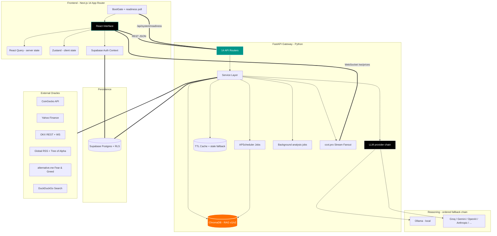

<div align="center">
  
  
  <h1 align="center">Oracle-X Financial Intelligence Terminal</h1>

  <p align="center">
    <strong>A Zero-Latency, Unified Command Center for Equities &amp; Digital Assets.</strong><br>
    <em>Converging traditional quantitative finance with blockchain analytics, on an LLM layer you choose — local or cloud.</em>
  </p>

  <p align="center">
    <a href="#system-architecture"></a>
    <a href="#tech-stack-deep-dive"></a>
    <a href="#the-reasoning-layer-provider-agnostic"></a>
    <a href="#3-the-rag-memory-stack-v1--v5"></a>
    <br/>
    
    
    <a href="#quality-gates"></a>
    
    
    
  </p>
</div>

<details>
  <summary>📚 Table of Contents</summary>
  <ol>
    <li><a href="#the-vision">The Vision</a></li>
    <li><a href="#core-capabilities">Core Capabilities</a></li>
    <li><a href="#system-architecture">System Architecture</a></li>
    <li><a href="#-directory-structure">Directory Structure</a></li>
    <li><a href="#tech-stack-deep-dive">Tech Stack Deep-Dive</a></li>
    <li><a href="#-rapid-deployment-strategy">Rapid Deployment Strategy</a></li>
    <li><a href="#-running-with-docker">Running with Docker</a></li>
    <li><a href="#environment-configuration">Environment Configuration</a></li>
    <li><a href="#-core-api-architecture">Core API Architecture</a></li>
    <li><a href="#quality-gates">Quality Gates</a></li>
    <li><a href="#the-road-ahead">The Road Ahead</a></li>
    <li><a href="#contributing">Contributing</a></li>
  </ol>
</details>

---

## The Vision

Modern traders, quantitative analysts, and financial researchers are forced into extreme context-switching. You use Bloomberg/Reuters for equities, CoinGecko/Glassnode for crypto, TradingView for raw charts, and X/Reddit for sentiment. This fragmented workflow introduces latency in decision-making.

**Oracle-X** eliminates the noise. It is an open-source, extensible intelligence terminal that aggregates multi-trillion dollar asset classes into a single pane of glass. By leveraging real-time WebSockets, background task scheduling, a persistent vector memory, and a **provider-agnostic reasoning layer**, Oracle-X doesn't just display data — it contextualizes it.

The AI layer is **local-first but not local-only**: the default configuration reasons entirely on your machine through [Ollama](https://ollama.com), and a single environment variable switches it to Groq, Gemini, Anthropic, OpenAI, or any of the other supported providers — with an ordered fallback chain so one provider's outage or rate limit is not the terminal's outage.

---

## Core Capabilities

### 1. Cross-Asset Market Matrix
Oracle-X breaks down the historic barrier between Wall Street and Web3 natively.
* **Equities (NASDAQ/NYSE):** Direct ingestion of live market caps, forward P/E ratios, analyst target bounds, margins, and free cash flow metrics using Yahoo Finance `quoteSummary` HTTP modules.
* **Digital Assets:** Real-time price streaming and deep protocol metrics via CoinGecko V3 and OKX public APIs.
* **Live Asset Registry:** Which coins the overview shows, which stocks the NASDAQ page ranks, and which pairs the socket streams are all resolved at runtime from CoinGecko / NASDAQ / OKX — never from a hardcoded list. Resolution degrades through an on-disk cache to a minimal emergency seed, so a cold start during an upstream outage still renders.
* **The "Deep Dive" Modal:** A glassmorphism UI modal that instantly surfaces 30+ specific data points per asset. View an equity's debt-to-equity ratio or a crypto protocol's trailing 4-week GitHub commit volume in one click, without navigating away from your charts.

### 2. The News Intelligence Pipeline
Standard keyword matching (regex) for financial news triggers massive false positives. Oracle-X runs an LLM ingestion pipeline instead.
* **Ingestion:** An `APScheduler` job asynchronously polls global feeds every `NEWS_FETCH_INTERVAL_MINUTES` (default **2 min**) — Tree of Alpha, Decrypt, CoinDesk, CoinTelegraph, The Block, CryptoSlate, Koin Bülteni and Uzmancoin for crypto; MarketWatch, Investing.com and Seeking Alpha for equities.
* **Semantic Ticker Extraction:** Article text is piped through the configured model, and `symbol_detection_service` fuses that reasoning with the live asset registry so headlines map to real tickers. Concurrency is capped by `SYMBOL_DETECTION_CONCURRENCY` so a 150-item refresh never floods the provider.
* **Attribution Memory:** A headline's asset is a property of its text, so it is resolved **once** and cached to disk (`news_attribution`). A restart doesn't re-bill the entire backlog, and a story can no longer be filed under BTC at 10:00 and ETH at 10:02. Results that came from the degraded heuristic path are marked and revisited.
* **Sentiment Scoring:** Bullish / Bearish / Neutral with a 0–100 confidence score. If no provider is reachable, the pipeline degrades to heuristic extraction rather than failing.
* **Per-Article Research Notes:** Clicking a headline starts a staged pipeline (`Gathering evidence → Judging price impact`) that fetches the **full article body** — with a hard timeout, a per-host circuit breaker, and paywall-stub rejection — merges it with technical levels and market context, and returns a verdict. Technical levels are copied verbatim from `technical_analysis_service`; the model is never asked to invent a price. Finished analyses are persisted and keyed by pipeline version, so a prompt edit retires the cache instead of serving stale reasoning forever.

### 3. The RAG Memory Stack (v1 → v5)
Oracle-X remembers. A ChromaDB vector store with `all-MiniLM-L6-v2` embeddings turns every ingested article and price tick into queryable institutional memory.
* **v1 — Outcome Memory** (`rag_service.py`): a single collection linking historical news to the price outcome that followed. Feeds the `/api/analyze` flow.
* **v2 — Temporal Core** (`rag_v2_service.py`): the primary store, split into `historical_news`, `market_events`, and `price_history` collections with up to 365 days of indexed history and event correlation.
* **v3 — Insights Agent:** answers *"why did BTC move on this date?"* — price-movement reasoning, historical news similarity, event-at-date lookup.
* **v4 — Reasoning Agent:** two-asset comparison and "what-if" scenario simulation.
* **v5 — Proactive Agent:** generates the daily morning brief and flags price-vs-news anomalies without being asked.

**Retrieval is scored, not just nearest-neighbour.** `rag_scoring.py` replaced raw embedding proximity with a composite of recency (per-collection half-lives), move magnitude, event class, and symbol relevance, behind a **calibrated cosine floor** (`RAG_MIN_RELEVANCE`, measured with `scripts/calibrate_rag_relevance.py` — not guessed). `rag_outcomes.py` measures what an event actually did across **1/7/30/90/180/365-day horizons** plus max drawdown and run-up, because a 7-day window labels both the XRP–SEC suit and the NVDA–DeepSeek crash backwards. Precedents whose outcome contradicted their headline are *boosted*, since they are the ones with something to teach. `rag_bellwethers.py` bounds the cost by spending that measurement on the assets that set market direction.

### 4. The Oracle Chat Agent
A conversational analyst wired directly into the memory stack.
* Routes each question across **RAG v2/v3/v4** plus live DuckDuckGo web search, then synthesizes the answer with the configured model. Every leg is time-boxed independently, so a slow source degrades the answer instead of hanging it.
* Full session management — conversations, message history, and renames persist in Supabase.
* Available as a dedicated chat page and as a global sidebar from anywhere in the terminal.

### 5. Staged Market Reports
`/api/analysis` produces daily / weekly / monthly reports through a **four-stage pipeline** — `collecting → synthesis → drafting → review`.
* Stage 1 is pure Python: `analysis_data.py` assembles nine independent feeds into one deterministic snapshot and computes breadth, ratios and deltas itself, so arithmetic never reaches the model. A failing feed is recorded in `unavailable` rather than aborting the run.
* Stages 2–4 extract evidence, draft the report, then **fact-check the draft back against the same snapshot**, striking figures the data doesn't support.
* Generation is never triggered by a read. Callers `POST` a job and poll it; a second caller for the same timeframe joins the in-flight run instead of starting a duplicate.

### 6. Real-Time & Derivatives Data
* **Live Price Socket:** the frontend subscribes to Oracle-X's own `/ws/prices` endpoint, which fans out `ccxt.pro` exchange WebSocket streams to every connected client — one upstream connection, N browsers. The venue is configurable via `STREAM_EXCHANGE` (default **OKX**, because Binance is unreachable from several countries and fails on `load_markets()` before a single tick arrives).
* **Liquidation Engine:** a long-running OKX liquidation WebSocket collector maintains rolling 24h history with disk persistence, powering the live feed and per-symbol levels.
* **Liquidation Map:** a Coinglass-style heatmap rebuilt from *free* OKX endpoints (candles + open interest + long/short account ratio). It models **where leveraged positions would be force-closed** — explicitly a different thing from the realised-liquidation feed above.
* **Funding Rates & Arbitrage:** perpetual funding rates on the home dashboard, plus a CCXT-backed multi-exchange price comparison and arbitrage scanner.

### 7. Alternative Data Vectors
* **Fear & Greed Index Synchronization:** real-time macro emotional states mapped across the UI.
* **On-Chain Flows:** whale transfers and exchange inflow/outflow tracking (optional Etherscan key).
* **Developer Velocity & Social Graph:** GitHub commit/issue velocity and community growth metrics surfaced inside the asset detail modal, mapping raw engineering effort to token price.

### 8. Accounts, Community & Bring-Your-Own-Key
* Supabase Auth (email/password + Google OAuth). **Authorization is enforced in the application layer** (`dependencies/auth.py`): the backend holds the service-role key and therefore bypasses RLS, so every user-scoped endpoint takes its identity from a verified bearer token — never from a client-supplied `user_id`.
* A community feed with posts, threaded comments, and likes.
* User profiles carrying subscription tier, connected accounts, preferences, and an AI query quota.
* **Per-user LLM settings:** each user can pick their own provider/model and supply their own API key, scoped to chat, news, and/or reports. Keys are encrypted with Fernet before they ever reach Supabase (`services/secret_box.py`) and are returned to the UI only as a hint, never in plaintext.

### 9. Boot Gate
A cold start touches a dozen upstreams. Rather than assembling itself panel by panel over half a minute, the frontend holds its first paint on `/api/system/readiness` and shows one splash with named steps (asset registry, liquidation stream, news, model warm-up, RAG embeddings). Required steps block; optional ones only mark the session **degraded**. The endpoint is pure in-memory state — it is polled twice a second — and nothing in the startup path blocks the socket from binding.

---

## System Architecture

Oracle-X operates on a strictly decoupled front-to-back architecture, engineered for high throughput, massive simultaneous API polling, and zero UI blocking.



---

## 📁 Directory Structure

Understanding the separation is crucial for contributing. The codebase is strictly typed and modular.

### Backend (FastAPI)
```text
backend/
├── main.py                     # ASGI factory, lifespan warm-up, CORS, GZip, router injection
├── config.py                   # pydantic-settings Settings singleton (reads backend/.env)
├── pyproject.toml              # ruff (line-length 100) + pytest configuration
├── requirements.txt            # runtime dependencies
├── requirements-dev.txt        # test + lint deps only — CI installs these, not torch
├── .env.example                # Environment template — copy to .env
├── dependencies/
│   └── auth.py                 # Bearer-token verification; the authorization boundary
├── models/
│   └── schemas.py              # Pydantic request/response models
├── prompts/                    # Prompt templates as plain Markdown, {{placeholder}} syntax
│   ├── analysis/               # stage1_evidence, stage2_report, stage3_review, system_analyst
│   ├── news/ chat/ detection/ generic/
├── routers/                    # 14 modules — full paths inline, no prefixes
│   ├── news.py                 # /api/news, /api/analyze, /api/symbols, /api/technical
│   ├── llm.py                  # /api/llm/status
│   ├── system.py               # /api/system/readiness
│   ├── market.py               # /api/fear-greed, /api/market-overview, /api/heatmap/data
│   ├── liquidation.py          # /api/liquidations/*, /api/market/candles
│   ├── home.py                 # /api/home/* (funding, onchain, macro calendar)
│   ├── watchlist.py            # /api/home/watchlist CRUD
│   ├── analysis.py             # /api/analysis/reports, /api/analysis/jobs, notes
│   ├── rag.py                  # /api/rag/* (initialize, query, insights, scenario, brief)
│   ├── chat.py                 # /api/chat, sessions, message history
│   ├── profile.py              # /api/profile/* (settings, subscription, quota, BYO-key)
│   ├── community.py            # /api/community/posts, comments, likes
│   ├── exchanges.py            # /api/exchanges, /api/multi-exchange, /api/arbitrage
│   └── websocket.py            # /ws/prices, /api/websocket/status
├── services/                   # Business logic — 46 modules
│   ├── llm/                    # Provider abstraction
│   │   ├── presets.py          # 14 provider rows (adapter, base_url, default model, key env)
│   │   ├── providers.py        # openai_compat / anthropic / ollama adapters
│   │   ├── client.py           # Chain resolution, retries, rate-limit + daily-quota cooldowns
│   │   └── user_prefs.py       # Per-user provider override resolution
│   ├── secret_box.py           # Fernet encryption for per-user API keys
│   ├── llm_settings_service.py # Per-user provider/model/key persistence
│   ├── ai_service.py           # Prompt assembly, response parsing, fallbacks
│   ├── prompts.py              # File-backed prompt loader ({{name}} substitution)
│   ├── readiness.py            # Startup step tracking for the boot gate
│   ├── asset_registry.py       # Live coin/stock/pair universe + disk cache + seed
│   ├── analysis_data.py        # Deterministic market snapshot (no LLM)
│   ├── analysis_service.py     # Four-stage market report pipeline
│   ├── analysis_jobs.py        # In-process job runner with stage progress + partials
│   ├── news_service.py         # RSS + Tree of Alpha aggregation
│   ├── article_service.py      # Full-article extraction (timeout, breaker, paywall reject)
│   ├── news_analysis_service.py / news_analysis_store.py   # Per-article research notes
│   ├── news_attribution.py     # Persistent headline → asset memory
│   ├── symbol_detection_service.py  # LLM + registry ticker resolution
│   ├── rag_service.py          # RAG v1 — outcome memory
│   ├── rag_v2_service.py       # RAG v2 — temporal core (3 collections)
│   ├── rag_v3_service.py / rag_v4_service.py / rag_v5_service.py   # Agent layer
│   ├── rag_scoring.py          # Pure composite relevance/importance scoring
│   ├── rag_outcomes.py         # Multi-horizon outcome measurement
│   ├── rag_bellwethers.py      # Curated direction-setting asset universe
│   ├── chat_service.py         # Oracle chat orchestration (RAG + web search + LLM)
│   ├── okx_market.py           # Single client for prices, candles, trades
│   ├── price_service.py        # Server-side single-symbol price resolution
│   ├── liquidation_service.py  # OKX liquidation WS collector (persisted)
│   ├── liquidation_map_service.py  # Modelled liquidation heatmap from free OKX data
│   ├── websocket_service.py    # ccxt.pro price stream fanout
│   ├── ccxt_service.py         # Multi-exchange REST + arbitrage
│   ├── asset_detail_service.py # 30+ field aggregator for the detail modal
│   ├── market_overview_service.py / stock_market_service.py / heatmap_service.py
│   ├── fear_greed_service.py / onchain_service.py / technical_analysis_service.py
│   ├── web_search_service.py   # DuckDuckGo search for the chat agent
│   ├── supabase_service.py / profile_service.py / community_service.py / watchlist_service.py
│   ├── scheduler_service.py    # APScheduler: news fetch + RAG re-index jobs
│   ├── http_client.py          # Shared async httpx client (+ impersonated transport)
│   └── cache.py                # ServiceCache (TTLCache) with stale-data fallback
├── tests/                      # 22 pytest modules — run in CI
└── data/                       # Local JSON state + ChromaDB stores (gitignored)
```

### Frontend (Next.js 14 App Router)
```text
frontend/
├── next.config.js              # Strict mode + /api/* rewrite proxy to the backend
├── tailwind.config.ts          # UI token system, custom hex colors
├── tsconfig.json               # Strict TypeScript compilation
├── .eslintrc.json / .prettierrc
├── .env.example                # Copy to .env.local
├── app/
│   ├── layout.tsx              # AuthProvider → ClientShell composition
│   ├── page.tsx                # Home dashboard
│   ├── overview/               # Cross-asset market matrix
│   ├── dashboard/              # News + charts + Oracle panel
│   ├── analysis/               # AI timeframe reports & notes
│   ├── chat/                   # Oracle chat agent
│   ├── community/              # Social feed
│   ├── heatmap/                # Multi-metric heatmap
│   ├── profile/                # Account, subscription, AI provider settings
│   └── error.tsx / globals.css
├── components/
│   ├── ClientShell.tsx         # QueryClientProvider + Navigation + GlobalTicker + Toasts
│   ├── BootGate.tsx / BootSplash.tsx   # Holds first paint until the backend is ready
│   ├── ErrorBoundary.tsx
│   ├── ui/                     # Panel, Modal, Logo, AssetTag primitives
│   ├── analysis/               # ReportView, AnalysisProgress, StageChecklist, NotesPanel
│   ├── overview/               # AdvancedHeatmap, AssetDetailModal, AssetTable, ...
│   ├── home/                   # FundingRates, LiquidationFeed, OnChainStats, Watchlist, ...
│   ├── profile/AIProviderSettings.tsx   # BYO provider/model/API key UI
│   ├── community/              # PostCard, CreatePostModal
│   ├── charts/LiquidationHeatmap.tsx
│   └── NewsFeed.tsx / ChartPanel.tsx / OraclePanel.tsx / ChatSidebar.tsx / ...
├── contexts/AuthContext.tsx    # Supabase session, signIn/signUp/signOut/OAuth
├── hooks/
│   ├── queries.ts              # React Query keys + typed hooks (optimistic mutations)
│   ├── useReadiness.ts         # /api/system/readiness poller for the boot gate
│   ├── useWebSocketPrices.ts   # /ws/prices client, reconnect + flash animation
│   └── usePriceAlerts.ts       # Global price alert watcher
├── lib/
│   ├── api.ts                  # fetch wrapper, ApiError, typed endpoint fetchers
│   ├── queryClient.ts          # QueryClient + global error → toast wiring
│   └── supabase.ts             # Lazy browser Supabase client
└── store/useStore.ts           # Zustand global client state
```

### Repository Root
```text
.
├── start.sh / start.bat        # One-click launchers (venv, ports, both servers, RAG seed)
├── docker-compose.yml          # Production-shaped stack
├── docker-compose.override.yml # Dev overrides (bind mounts, --reload, next dev)
├── supabase/migrations/        # 001_initial_schema → 006_user_llm_settings
├── scripts/
│   ├── calibrate_rag_relevance.py   # Measures the RAG relevance floor against your store
│   └── generate_brand_assets.py
├── .github/workflows/ci.yml    # ruff + compileall + pytest | lint, typecheck, build
└── .pre-commit-config.yaml     # ruff (backend) + prettier (frontend) + hygiene hooks
```

---

## Tech Stack Deep-Dive

### The UI Layer (Next.js 14 App Router)
* **Framework:** Builds are optimized with the SWC Rust compiler; server components keep client bundles lean.
* **Server State (`React Query`):** Every backend read goes through `@tanstack/react-query` with a central key registry (`hooks/queries.ts`), 30s stale time, exponential-backoff retries, and a global error handler that surfaces failures as toasts (`lib/queryClient.ts`). Mutations like watchlist deletion are optimistic with automatic rollback.
* **Client State (`Zustand`):** Context API causes total DOM re-renders. Zustand binds real-time WebSocket price updates to atomic components without re-rendering the heatmap.
* **Styling (`Tailwind CSS`):** No MUI/Chakra — hand-rolled dark-mode glassmorphism for exact pixel control, on a small set of shared primitives (`components/ui`).
* **Charting:** Apache ECharts for the data-dense panels (liquidation heatmap, treemaps) and embedded TradingView widgets for classic price action.

### The API Engine (FastAPI & Python 3.11+)
* **Asynchronous IO:** The entire backend is `async def`. Outbound calls share a single configured `httpx.AsyncClient` (`services/http_client.py`); blocking work is dispatched to thread pools so the event loop never stalls.
* **Non-blocking startup:** Uvicorn binds its socket before any warm-up runs. Registry priming, model loading, the first news fetch and embedding warm-up all execute as tracked background tasks that report into `readiness` — so the boot gate can poll from the very first second.
* **Configuration (`pydantic-settings`):** A cached `Settings` singleton reads `backend/.env`, exposing typed feature flags, intervals, provider chains and CORS origins, and failing fast at startup when Supabase credentials are absent.
* **Caching:** `cachetools`-backed `ServiceCache` with per-service TTLs and **stale-data fallback** — if an upstream provider rate-limits, the last good payload is served instead of an error.
* **Transport realism:** A `curl_cffi` transport replays a browser TLS/HTTP2 fingerprint for the few upstreams that fingerprint the handshake (CNN's Fear & Greed feed, Yahoo's chart API) and answer 418 to ordinary clients regardless of User-Agent.
* **Scheduling & Jobs:** `APScheduler` drives periodic news ingestion and RAG re-indexing; `analysis_jobs` runs the long LLM pipelines out of the request path with pollable stage progress.

### The Reasoning Layer (provider-agnostic)
* **14 providers, one interface.** `ollama`, `groq`, `gemini`, `openai`, `anthropic`, `openrouter`, `deepseek`, `together`, `mistral`, `xai`, `cerebras`, `fireworks`, `perplexity`, and `custom` (any self-hosted vLLM / LM Studio / LiteLLM proxy). Adding one is a row in `presets.py`, not new code, as long as it speaks the OpenAI chat-completions format — which nearly all of them do. Two adapters cover the rest: Ollama's native API, and Anthropic's `/v1/messages` (its OpenAI shim is documented as beta and "not intended for production").
* **Ordered fallback chain.** `LLM_PROVIDER` names the primary and `LLM_FALLBACK_PROVIDERS` the chain behind it. An entry is skipped when it is unreachable, its key is missing, its model id is unknown, or it is still rate-limited after its retries.
* **Rate limits treated as first-class.** A 429 with a stated delay is waited out only if it fits `LLM_RATE_LIMIT_MAX_WAIT`; otherwise the chain moves on and that provider is put on cooldown, because free tiers count rejected calls against the same quota. A spent *daily* budget gets a much longer cooldown (`LLM_DAILY_QUOTA_COOLDOWN`) since providers report it as if it were a rolling minute.
* **Local-first defaults.** With `LLM_PROVIDER=ollama`, headlines, portfolios and chat questions never leave the machine. `qwen3.6:35b-a3b` (MoE, ~3B active params) is the recommended default; `qwen3.5:9b` fits lighter hardware. `OLLAMA_KEEP_ALIVE` keeps the model resident so a quiet period isn't followed by a reload that times out every racing call.
* **Prompts live in files.** `backend/prompts/**.md` with `{{placeholder}}` substitution — reviewable and tunable without touching Python.
* **Graceful degradation.** Every LLM call has a fallback path, so the terminal stays usable with no provider at all — you lose AI scoring and chat, not market data.
* **Embeddings** run separately through `sentence-transformers` (`all-MiniLM-L6-v2`), warmed at startup on CUDA / MPS / CPU depending on the host.

---

## 🚀 Rapid Deployment Strategy

Oracle-X runs entirely locally on a MacBook, Windows PC, or Ubuntu server.

### System Prerequisites
| Requirement | Minimum Version | Notes |
|-------------|----------------|-------|
| Node.js | v18.17.0 | Required for Next.js 14 (CI builds on v20) |
| Python | v3.11 | Matches CI |
| npm | Latest | Package management |
| Git | Latest | For cloning the repo |
| Ollama | Latest | **Optional** — only for `LLM_PROVIDER=ollama`; a cloud key works instead |

> **Hardware note:** `qwen3.6:35b-a3b` needs roughly 24 GB of free RAM/VRAM; `qwen3.5:9b` fits in about 7 GB. On Apple Silicon both run on the Metal backend out of the box. Prefer no local model? Set `LLM_PROVIDER=groq:llama-3.3-70b-versatile` (or any other supported provider) and skip Ollama entirely.

### ⚡ The 1-Click Boot (Recommended)
`start.sh` (macOS/Linux) and `start.bat` (Windows) provision the virtualenv, free ports 8000/3100, boot both servers, and seed the RAG 2.0 index by POSTing `/api/rag/initialize` once the API is healthy.

```bash
# 1. Clone the intelligence matrix
git clone https://github.com/Yigtwxx/crypto-stock-lens.git
cd crypto-stock-lens

# 2. Configure environments
cp backend/.env.example backend/.env
cp frontend/.env.example frontend/.env.local
# → fill in your Supabase credentials (required)
# → pick an LLM provider: keep the Ollama default, or set LLM_PROVIDER + its API key

# 3. Only if you're running locally: pull the model (one time)
ollama pull qwen3.6:35b-a3b

# 4. Ignite the servers
chmod +x start.sh
./start.sh
```

**On Windows**, skip the `cp`/`chmod` steps — `start.bat` copies the `.env` templates itself:

```bat
git clone https://github.com/Yigtwxx/crypto-stock-lens.git
cd crypto-stock-lens
ollama pull qwen3.6:35b-a3b
start.bat
```

> Windows builds its own virtualenv at `backend\venv-win\` so it never collides with the POSIX `backend/venv/` that `start.sh` creates. Backend and frontend each open in their own console window; close them to stop the services.

### 🛠 Manual Infrastructure Standup

**1. Booting the Intelligence Engine (Backend):**
```bash
cd backend

# Provision isolated Python environment (start.sh expects this path)
python3 -m venv venv
source venv/bin/activate        # Windows: venv\Scripts\activate

pip install -r requirements.txt
cp .env.example .env

uvicorn main:app --reload --host 0.0.0.0 --port 8000
```
*Health check at `http://localhost:8000/` — Swagger UI at `http://localhost:8000/docs` — startup progress at `/api/system/readiness`*

**2. Booting the Interface (Frontend):**
```bash
cd frontend

npm install
cp .env.example .env.local

npm run dev
```
*Access the Web Terminal at: `http://localhost:3100`*

**3. Seeding the Vector Memory (optional, one time):**
```bash
curl -X POST http://localhost:8000/api/rag/initialize
```

---

## 🐳 Running with Docker

The whole stack is containerized. One `.env` at the repo root configures both services.

**Prerequisites:** Docker Desktop (`brew install --cask docker-desktop` on macOS, then open `/Applications/Docker.app` once to grant permissions).

```bash
cp .env.example .env      # then fill in the Supabase values
docker compose up --build
```

Frontend at `http://localhost:3100`, backend at `http://localhost:8000`.

### Dev vs production

`docker-compose.override.yml` is loaded automatically and turns the stack into a development environment: source is bind-mounted, uvicorn runs with `--reload`, and the frontend runs `next dev`.

To run the production images instead — optimized multi-stage builds, `next start` on a standalone bundle — skip the override explicitly:

```bash
docker compose -f docker-compose.yml up --build
```

### Ollama

If you use the local provider, Ollama runs **on the host**, not in a container: on Apple Silicon a containerized Ollama cannot reach the Metal GPU, which makes the default model unusably slow. The backend is preconfigured for `http://host.docker.internal:11434`, so once you `ollama pull <model>` on the host it just connects. Until then the backend starts normally and only logs a warning — AI features fall through the chain or switch off. With a cloud provider configured, none of this applies.

### Deploying to a server

Three values change together, since the browser (not the container) resolves them:

| Variable | Local | Server |
|---|---|---|
| `NEXT_PUBLIC_API_URL` | `http://localhost:8000` | `https://api.yourdomain.com` |
| `NEXT_PUBLIC_WS_URL` | `ws://localhost:8000/ws/prices` | `wss://api.yourdomain.com/ws/prices` |
| `CORS_ORIGINS` | `http://localhost:3100` | `https://yourdomain.com` |

`NEXT_PUBLIC_*` values are baked into the client bundle at build time, so changing them requires a rebuild (`docker compose build frontend`), not just a restart.

Runtime state — Chroma vector stores, watchlists, analysis reports, liquidation history — lives in the `backend-data` named volume and survives `docker compose down`. Use `docker compose down -v` only when you intend to wipe it.

The backend runs a **single uvicorn worker** by design: the APScheduler jobs, the liquidation collector, the analysis job registry and the price-streaming service are per-process singletons, so scaling means running one container, not more workers.

---

## Environment Configuration

Both sides ship a committed `.env.example` — copy, don't guess. **Every variable has a working default except the Supabase credentials**, which the backend validates at startup and refuses to boot without. Features whose key is missing simply switch off.

### `backend/.env`
```env
# ── Supabase (required — startup fails without these) ────────────────────────
SUPABASE_URL=https://your-project.supabase.co
SUPABASE_KEY=your-publishable-anon-key
# Service-role key bypasses RLS — keep it secret, backend only.
SUPABASE_SERVICE_ROLE_KEY=your-service-role-secret-key

# ── LLM provider ─────────────────────────────────────────────────────────────
# Format: <provider> or <provider>:<model>. Only the FIRST colon splits them,
# so Ollama tags survive: ollama:qwen3.6:35b-a3b
# Supported: ollama, groq, gemini, openai, anthropic, openrouter, deepseek,
#            together, mistral, xai, cerebras, fireworks, perplexity, custom
LLM_PROVIDER=ollama
LLM_FALLBACK_PROVIDERS=            # e.g. gemini:gemini-flash-latest,ollama
LLM_MODEL=qwen3.6:35b-a3b          # used when a chain entry omits ":<model>"
LLM_MAX_RETRIES=3
LLM_RATE_LIMIT_MAX_WAIT=30         # 60 rides out a free-tier per-minute quota
LLM_RATE_LIMIT_COOLDOWN=60
LLM_DAILY_QUOTA_COOLDOWN=1800

# Encrypts per-user API keys before they reach Supabase. Empty disables the
# BYO-key feature entirely — a key is never stored in plaintext.
#   python -c "from cryptography.fernet import Fernet; print(Fernet.generate_key().decode())"
LLM_KEY_ENCRYPTION_SECRET=

# Only for LLM_PROVIDER=custom (self-hosted vLLM / LM Studio / LiteLLM proxy).
LLM_BASE_URL=
LLM_API_KEY=

# ── Local LLM (Ollama) ───────────────────────────────────────────────────────
OLLAMA_BASE_URL=http://localhost:11434
OLLAMA_KEEP_ALIVE=30m              # "-1" pins the model until the daemon stops

# ── Provider API keys — fill in only the one(s) you use ──────────────────────
GROQ_API_KEY=
GEMINI_API_KEY=
OPENAI_API_KEY=
ANTHROPIC_API_KEY=
OPENROUTER_API_KEY=
DEEPSEEK_API_KEY=
TOGETHER_API_KEY=
MISTRAL_API_KEY=
XAI_API_KEY=
CEREBRAS_API_KEY=
FIREWORKS_API_KEY=
PERPLEXITY_API_KEY=

# ── Optional external API keys ───────────────────────────────────────────────
ETHERSCAN_API_KEY=          # on-chain exchange flows; empty disables the feature

# ── Market data ──────────────────────────────────────────────────────────────
# CCXT exchange id for the live price socket. Binance is blocked in several
# countries and fails on load_markets(); any CCXT Pro venue with watch_tickers
# works — okx, bybit, kucoin, coinbase, kraken…
STREAM_EXCHANGE=okx

# ── Feature flags ────────────────────────────────────────────────────────────
USE_REAL_API=true
USE_AI=true                 # master switch for AI, whichever provider is set

# ── CORS (comma-separated allowed frontend origins) ──────────────────────────
CORS_ORIGINS=http://localhost:3100,http://127.0.0.1:3100

# ── Background scheduler intervals (minutes) ─────────────────────────────────
NEWS_FETCH_INTERVAL_MINUTES=2
RAG_INDEX_INTERVAL_MINUTES=30

# ── Logging (DEBUG | INFO | WARNING | ERROR) ─────────────────────────────────
LOG_LEVEL=INFO
```

RAG retrieval tuning (`RAG_MIN_RELEVANCE`, recency half-lives, importance weights, outcome horizons) all have measured defaults in `config.py` and are documented, commented-out, in `backend/.env.example`. Re-measure the relevance floor against your own store rather than guessing at it:

```bash
cd backend && ./venv/bin/python ../scripts/calibrate_rag_relevance.py
```

### `frontend/.env.local`
```env
NEXT_PUBLIC_API_URL=http://localhost:8000
NEXT_PUBLIC_WS_URL=ws://localhost:8000/ws/prices

# Client-side auth — publishable/anon key only, never the service-role key.
NEXT_PUBLIC_SUPABASE_URL=https://your-project.supabase.co
NEXT_PUBLIC_SUPABASE_ANON_KEY=your-publishable-anon-key
```

### Supabase Schema
Apply the migrations in order from `supabase/migrations/` — `001_initial_schema.sql`, `002_chat_messages.sql`, `003_chat_sessions.sql`, `004_profile_features.sql`, `005_community.sql`, `006_user_llm_settings.sql` — via the Supabase SQL editor or CLI. Without them, auth-gated pages (chat history, community, profile, per-user AI settings) will render but fail to persist.

### Degradation Matrix
| Missing | Consequence |
|---------|-------------|
| No reachable LLM provider | No AI sentiment, research notes, market reports, or Oracle chat. Market data, charts, and heatmaps unaffected. |
| Supabase credentials | **Backend refuses to start** — these are validated at boot. |
| `LLM_KEY_ENCRYPTION_SECRET` | Per-user BYO-key feature is disabled; the server-side provider chain still works. |
| `ETHERSCAN_API_KEY` | On-chain whale/exchange-flow widgets go empty. |
| Upstream market API down | Last good cached payload is served (stale fallback) instead of an error. |

---

## 🔌 Core API Architecture

Oracle-X is a fully headless data provider. Quantitative traders can plug bots or Python scripts directly into the FastAPI endpoints without opening the UI. All payloads return `application/json`; user-scoped routes require a Supabase bearer token.

### Market Data
| Endpoint | Method | Response Payload & Logic |
|----------|--------|-----------------|
| `/api/market-overview` | `GET` | Global crypto market cap, dominance, and top movers from CoinGecko's `/global` and `/coins/markets` endpoints. |
| `/api/nasdaq-overview` | `GET` | Live cached metrics for the 'Magnificent 7' and core equities. |
| `/api/market/indices` | `GET` | Traditional index snapshots. |
| `/api/asset-detail/{symbol}` | `GET` | Intelligent resolver combining CoinGecko ID mapping and Yahoo Finance `quoteSummary`. Returns 30+ dynamic fields. |
| `/api/price/{symbol}` | `GET` | Single spot price, crypto or equity, resolved server-side. |
| `/api/market/candles/{symbol}` | `GET` | OHLCV series from OKX. |
| `/api/heatmap/data` | `GET` | Nested JSON structured for treemap consumption — price change, volume, social hype, dev activity. |
| `/api/fear-greed` | `GET` | Integer index (`0-100`) plus sentiment categorization. |
| `/api/technical/{symbol}` | `GET` | ATR-based support/resistance and price targets from OKX OHLCV. |

### News & AI
| Endpoint | Method | Response Payload & Logic |
|----------|--------|-----------------|
| `/api/news` | `GET` | Articles scored `Bullish/Bearish/Neutral` with confidence and LLM-extracted tickers. |
| `/api/news/{news_id}` | `GET` | A single article by id. |
| `/api/news/{news_id}/analysis/jobs` | `POST` | Starts the staged per-article research note; joins an in-flight run for the same article. |
| `/api/news/analysis/jobs/{job_id}` | `GET` | Polls that job for its current stage, partial result, and final verdict. |
| `/api/news/{news_id}/analysis` | `GET` | The cached analysis, if one has already been produced for the current pipeline version. |
| `/api/analyze` | `POST` | Runs a single article through the LLM + RAG v1 outcome memory. |
| `/api/symbols` | `GET` | Currently tracked symbol universe. |
| `/api/llm/status` | `GET` | Active provider/model, the resolved fallback chain, skipped entries and why. `?include_models=true` lists what each provider currently offers. Keys are never returned. |
| `/api/analysis/reports` | `GET` | Freshness of the stored daily/weekly/monthly reports. Never generates. |
| `/api/analysis/report/{timeframe}` | `GET` | The stored market report, or an empty one if it has not been generated yet. |
| `/api/analysis/jobs/{timeframe}` | `POST` | Starts the four-stage report pipeline in the background; joins an in-flight run for the same timeframe. |
| `/api/analysis/jobs/{job_id}` | `GET` | Polls a running report job for its current stage, and its result once finished. |

### RAG & Agents
| Endpoint | Method | Response Payload & Logic |
|----------|--------|-----------------|
| `/api/rag/initialize` | `POST` | Seeds the v2 store with historical news, events, and prices. |
| `/api/rag/stats` | `GET` | Collection counts and index health. |
| `/api/rag/query` | `GET` | Semantic search across the temporal memory, composite-scored. |
| `/api/rag/news-similarity` | `POST` | Nearest historical precedents for a supplied headline. |
| `/api/rag/event-at-date` | `GET` | What the store knows happened on a given date. |
| `/api/rag/insights/{symbol}` | `GET` | v3 Insights Agent — why an asset moved. |
| `/api/rag/compare/{a}/{b}` | `GET` | v4 Reasoning Agent — two-asset comparison. |
| `/api/rag/scenario` | `POST` | v4 "what-if" scenario simulation. |
| `/api/rag/daily-brief` | `GET` | v5 Proactive Agent — morning brief. |
| `/api/rag/anomalies` | `GET` | v5 price-vs-news divergence detection. |
| `/api/chat` | `POST` | Oracle chat agent (RAG + web search + configured LLM). |
| `/api/chat/status` | `GET` | Whether the chat agent is available, and which provider is serving it. |

### Derivatives, Exchanges & Real-Time
| Endpoint | Method | Response Payload & Logic |
|----------|--------|-----------------|
| `/api/liquidations/heatmap` | `GET` | Aggregated realised-liquidation clusters from the OKX WS collector. |
| `/api/liquidations/map/{symbol}` | `GET` | Modelled liquidation map — where leveraged positions would be force-closed. |
| `/api/liquidations/levels/{symbol}` | `GET` | Per-symbol liquidation levels. |
| `/api/liquidations/history/{symbol}` | `GET` | Rolling 24h realised-liquidation history. |
| `/api/home/funding-rates` | `GET` | Perpetual funding rates across major pairs. |
| `/api/home/onchain` | `GET` | Whale transfers and exchange in/outflows. |
| `/api/exchanges` | `GET` | CCXT-supported exchange registry. |
| `/api/arbitrage/{base}/{quote}` | `GET` | Cross-exchange spread for a pair; `/api/arbitrage/scan` sweeps the board. |
| `/ws/prices` | `WS` | Live price stream — `snapshot` on connect, then `price_update` frames. |

### User, Social & System
| Endpoint | Method | Response Payload & Logic |
|----------|--------|-----------------|
| `/api/system/readiness` | `GET` | Startup progress for the boot gate — per-step state, `ready`, `degraded`, `blocked`. No I/O. |
| `/api/home/watchlist` | `GET/POST/DELETE` | Watchlist CRUD with live prices merged in. |
| `/api/analysis/notes` | `GET/POST/DELETE` | Personal research notes. |
| `/api/profile` | `GET/PUT` | Profile, subscription, connected accounts, settings. Identity comes from the token. |
| `/api/profile/llm` | `GET/PUT/DELETE` | Per-user provider, model and encrypted API key. `POST /api/profile/llm/test` validates a key before saving. |
| `/api/community/posts` | `GET/POST` | Community feed; nested comment and like routes below it. |

### API Request Example (Python Bot)
```python
import httpx

# Fetch detailed NVIDIA fundamentals locally
r = httpx.get("http://localhost:8000/api/asset-detail/NVDA")
data = r.json()

print(f"Forward P/E: {data['forward_pe']}")
print(f"Target High: {data['target_high_price']}")
print(f"Analyst Rec: {data['recommendation']}")
```

---

## Quality Gates

CI (`.github/workflows/ci.yml`) runs on every push and PR to `main`, in two jobs:

| Job | Steps |
|-----|-------|
| **Backend** (Python 3.11) | `ruff check .` → `python -m compileall` → `pytest` |
| **Frontend** (Node 20) | `npm ci` → `npm run lint` → `npm run typecheck` → `npm run build` |

The backend suite is **22 pytest modules** covering the LLM chain and rate-limit behaviour, per-user settings and key encryption, auth enforcement, prompt rendering, RAG scoring/outcomes, symbol detection, news attribution and the analysis pipelines. `requirements-dev.txt` deliberately excludes torch/chromadb so CI installs only what the tests import.

`.pre-commit-config.yaml` wires the same tools locally:

```bash
pip install pre-commit && pre-commit install
pre-commit run --all-files
```

---

## The Road Ahead

We are actively executing the roadmap towards **v2.0**.

- [x] **v0.5 (Foundation):** Dark-mode premium layout, UI component scaffolding, Next.js routing.
- [x] **v1.0 (Data Convergence):** Real-time wrappers (CoinGecko, Yahoo Finance `quoteSummary`), TTL caching layer.
- [x] **v1.2 (AI Genesis):** Local semantic extraction pipeline for news, complex asset detail views, heatmap algorithms.
- [x] **v1.5 (Accounts):** Supabase Auth with application-layer authorization — user profiles, community feed, and chat history.
- [x] **v1.5+ (Memory & Agents):** ChromaDB RAG v2 temporal store, the v3/v4/v5 agent layer, and the Oracle chat agent with web-search augmentation.
- [x] **v1.6 (Provider Freedom):** Provider-agnostic LLM layer with fallback chains and rate-limit handling, per-user BYO keys encrypted at rest, file-backed prompts, staged report/news pipelines with job polling, calibrated RAG scoring with multi-horizon outcomes, and the startup boot gate.
- [ ] **v1.7 (Hardening):** `pytest` suite in CI ✅ · frontend `vitest` suite ⏳ · contract tests over the endpoint matrix ⏳.
- [ ] **v1.8 (Personalization):** Migration of watchlists and notes off JSON onto Supabase, portfolio allocation views, custom dashboard layout saving.
- [ ] **v2.0 (The Oracle):** Deployment of Solidity oracles. AI price impact probabilities committed to Sepolia testnet for immutable track-record tracking.

---

## Contributing

We are building the open-source terminal of the future. Whether you are a Rust quant, a React UI wizard, or a Python data scientist, your PRs are welcomed and needed.

**Contribution Guidelines:**
1. **Fork** the project repository.
2. **Branching:** Create your feature branch off `main` (`git checkout -b feature/QuantumAlgorithm`)
3. **Commit Standards:** Use conventional commits. (`git commit -m 'feat(api): add Quantum Pricing Model endpoint'`)
4. **Push:** Push to the branch (`git push origin feature/QuantumAlgorithm`)
5. **PR:** Open a Pull Request targeting `main`. Provide screenshots if modifying the UI.

Before opening a PR, run the gates locally:

```bash
# Backend — the first three are CI; ruff format is enforced by pre-commit.
cd backend && ruff check . && python -m compileall -q -x "venv|data" . && pytest && ruff format --check .

# Frontend
cd frontend && npm run lint && npm run typecheck && npm run build
```

Endpoints without test coverage should still be exercised manually against `http://localhost:8000/docs`; note what you verified in the PR description.

---

<div align="center">
  <p>Engineered with violent execution and absolute precision.<br>
  <strong>Welcome to Oracle-X.</strong></p>
</div>
