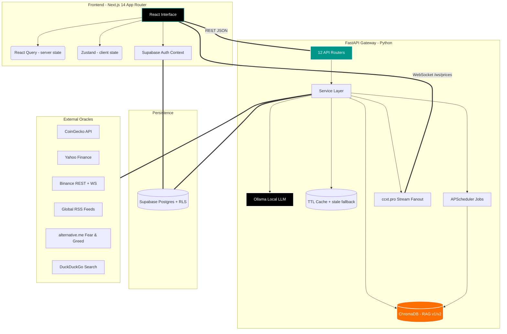

<div align="center">
  
  
  <h1 align="center">Oracle-X Financial Intelligence Terminal</h1>

  <p align="center">
    <strong>A Zero-Latency, Unified Command Center for Equities & Digital Assets.</strong><br>
    <em>Converging traditional quantitative finance with blockchain analytics, powered by Local-First AI semantic extraction.</em>
  </p>

  <p align="center">
    <a href="#system-architecture"></a>
    <a href="#tech-stack-deep-dive"></a>
    <a href="#tech-stack-deep-dive"></a>
    <a href="#core-capabilities"></a>
    <br/>
    
    
    
    
    
  </p>
</div>

<details>
  <summary>📚 Table of Contents</summary>
  <ol>
    <li><a href="#the-vision">The Vision</a></li>
    <li><a href="#core-capabilities">Core Capabilities</a></li>
    <li><a href="#system-architecture">System Architecture</a></li>
    <li><a href="#-directory-structure">Directory Structure</a></li>
    <li><a href="#tech-stack-deep-dive">Tech Stack Deep-Dive</a></li>
    <li><a href="#-rapid-deployment-strategy">Rapid Deployment Strategy</a></li>
    <li><a href="#environment-configuration">Environment Configuration</a></li>
    <li><a href="#-core-api-architecture">Core API Architecture</a></li>
    <li><a href="#the-road-ahead">The Road Ahead</a></li>
    <li><a href="#contributing">Contributing</a></li>
  </ol>
</details>

---

## The Vision

Modern traders, quantitative analysts, and financial researchers are forced into extreme context-switching. You use Bloomberg/Reuters for equities, CoinGecko/Glassnode for crypto, TradingView for raw charts, and X/Reddit for sentiment. This fragmented workflow introduces latency in decision-making.

**Oracle-X** eliminates the noise. It is an open-source, extensible intelligence terminal that aggregates multi-trillion dollar asset classes into a single pane of glass. By leveraging real-time WebSockets, background task scheduling, a persistent vector memory, and a **fully local LLM**, Oracle-X doesn't just display data—it contextualizes it. No API keys are shipped off to a model provider: the reasoning layer runs on your own machine via [Ollama](https://ollama.com).

---

## Core Capabilities

### 1. Cross-Asset Market Matrix
Oracle-X breaks down the historic barrier between Wall Street and Web3 natively.
* **Equities (NASDAQ/NYSE):** Direct ingestion of live market caps, forward P/E ratios, analyst target bounds, margins, and free cash flow metrics using Yahoo Finance `quoteSummary` HTTP modules.
* **Digital Assets:** Real-time price streaming and deep protocol metrics via CoinGecko V3 and Binance public APIs.
* **The "Deep Dive" Modal:** A glassmorphism UI modal that instantly surfaces 30+ specific data points per asset. View an equity's debt-to-equity ratio or a crypto protocol's trailing 4-week GitHub commit volume in one click, without navigating away from your charts.

### 2. Local-First LLM News Engine
Standard keyword matching (regex) for financial news triggers massive false positives. We built an AI ingestion engine that runs entirely on your hardware.
* **The Ingestion Pipeline:** An `APScheduler` job asynchronously polls global RSS feeds every `NEWS_FETCH_INTERVAL_MINUTES` (default **2 min**) in a non-blocking thread — Decrypt, CoinDesk, CoinTelegraph, Koin Bülteni for crypto; MarketWatch, Investing.com, Seeking Alpha for equities.
* **Semantic Ticker Extraction:** Raw article bodies are piped into a local `qwen3.6` model through Ollama. The `symbol_detection_service` fuses LLM reasoning with a dynamically refreshed CoinGecko coin list so headlines map to the correct tickers.
* **Sentiment Scoring:** The model assigns Bullish / Bearish / Neutral weights with a confidence score (0–100), quantifying narrative impact before market reaction. If Ollama is offline, the pipeline degrades gracefully to heuristic extraction instead of failing.

### 3. The RAG Memory Stack (v1 → v5)
Oracle-X remembers. A ChromaDB vector store with `all-MiniLM-L6-v2` embeddings turns every ingested article and price tick into queryable institutional memory.
* **v1 — Outcome Memory** (`rag_service.py`): a single collection linking historical news to the price outcome that followed. Feeds the `/api/analyze` flow.
* **v2 — Temporal Core** (`rag_v2_service.py`): the primary store, split into `historical_news`, `market_events`, and `price_history` collections with up to 365 days of indexed history and event correlation.
* **v3 — Insights Agent:** answers *"why did BTC move on this date?"* — price-movement reasoning, historical news similarity, event-at-date lookup.
* **v4 — Reasoning Agent:** two-asset comparison and "what-if" scenario simulation.
* **v5 — Proactive Agent:** generates the daily morning brief and flags price-vs-news anomalies without being asked.

### 4. The Oracle Chat Agent
A conversational analyst wired directly into the memory stack.
* Routes each question across **RAG v2/v3/v4** plus live DuckDuckGo web search, then synthesizes the answer with the local LLM.
* Full session management — conversations, message history, and renames persist in Supabase.
* Streams into a dedicated chat page and a global sidebar available from anywhere in the terminal.

### 5. Real-Time & Derivatives Data
* **Live Price Socket:** the frontend subscribes to Oracle-X's own `/ws/prices` endpoint, which fans out `ccxt.pro` exchange WebSocket streams to every connected client — one upstream connection, N browsers.
* **Liquidation Engine:** a long-running Binance liquidation WebSocket collector maintains rolling history, powering the liquidation heatmap, per-symbol levels, and the live liquidation feed.
* **Funding Rates & Arbitrage:** perpetual funding rates on the home dashboard, plus a CCXT-backed multi-exchange price comparison and arbitrage scanner.

### 6. Alternative Data Vectors
* **Fear & Greed Index Synchronization:** real-time macro emotional states mapped across the UI.
* **On-Chain Flows:** whale transfers and exchange inflow/outflow tracking (optional Etherscan key).
* **Developer Velocity & Social Graph:** GitHub commit/issue velocity and community growth metrics surfaced inside the asset detail modal, mapping raw engineering effort to token price.

### 7. Accounts, Community & Profiles
* Supabase Auth (email/password + Google OAuth) with RLS-backed persistence.
* A community feed with posts, threaded comments, and likes.
* User profiles carrying subscription tier, connected accounts, preferences, and an AI query quota.

---

## System Architecture

Oracle-X operates on a strictly decoupled front-to-back architecture, engineered for high throughput, massive simultaneous API polling, and zero UI blocking.



---

## 📁 Directory Structure

Understanding the separation is crucial for contributing. The codebase is strictly typed and modular.

### Backend (FastAPI)
```text
OracleX/backend/
├── main.py                     # ASGI entry point, lifespan startup, CORS, router injection
├── config.py                   # pydantic-settings Settings singleton (reads backend/.env)
├── utils.py                    # Shared helpers
├── requirements.txt            # pip dependencies
├── pyproject.toml              # ruff lint/format config (line-length 100)
├── .env.example                # Environment template — copy to .env
├── models/
│   └── schemas.py              # Pydantic request/response models
├── routers/                    # All HTTP + WS endpoints (no prefixes, full paths inline)
│   ├── news.py                 # /api/news, /api/analyze, /api/symbols, /api/technical
│   ├── market.py               # /api/fear-greed, /api/market-overview, /api/heatmap/data
│   ├── liquidation.py          # /api/liquidations/*, /api/market/candles
│   ├── home.py                 # /api/home/* (funding, onchain, macro calendar)
│   ├── watchlist.py            # /api/home/watchlist CRUD
│   ├── analysis.py             # /api/analysis/report, /api/analysis/notes
│   ├── rag.py                  # /api/rag/* (initialize, query, insights, scenario, brief)
│   ├── chat.py                 # /api/chat, sessions, message history
│   ├── profile.py              # /api/profile/* (settings, subscription, AI quota)
│   ├── community.py            # /api/community/posts, comments, likes
│   ├── exchanges.py            # /api/exchanges, /api/multi-exchange, /api/arbitrage
│   └── websocket.py            # /ws/prices, /api/websocket/status
├── services/                   # Business logic — 28 modules
│   ├── ollama_service.py       # Local LLM client: completion, sentiment, health, fallbacks
│   ├── news_service.py         # RSS aggregation via feedparser
│   ├── symbol_detection_service.py  # LLM + CoinGecko list ticker resolution
│   ├── rag_service.py          # RAG v1 — outcome memory
│   ├── rag_v2_service.py       # RAG v2 — temporal core (3 collections)
│   ├── rag_v3_service.py       # Insights Agent
│   ├── rag_v4_service.py       # Reasoning Agent (compare / scenario)
│   ├── rag_v5_service.py       # Proactive Agent (daily brief / anomalies)
│   ├── chat_service.py         # Oracle chat orchestration (RAG + web search + LLM)
│   ├── analysis_service.py     # Timeframe AI report generation
│   ├── asset_detail_service.py # 30+ field aggregator for the detail modal
│   ├── market_overview_service.py / stock_market_service.py / heatmap_service.py
│   ├── fear_greed_service.py / onchain_service.py / technical_analysis_service.py
│   ├── liquidation_service.py  # Binance liquidation WS collector
│   ├── websocket_service.py    # ccxt.pro price stream fanout
│   ├── ccxt_service.py         # Multi-exchange REST + arbitrage
│   ├── web_search_service.py   # DuckDuckGo search for the chat agent
│   ├── supabase_service.py / profile_service.py / community_service.py / watchlist_service.py
│   ├── scheduler_service.py    # APScheduler: news fetch + RAG re-index jobs
│   ├── http_client.py          # Shared async httpx client + get_json helper
│   └── cache.py                # ServiceCache (TTLCache) with stale-data fallback
└── data/                       # Local JSON state + ChromaDB stores (rag/, rag_v2/)
```

### Frontend (Next.js 14 App Router)
```text
OracleX/frontend/
├── next.config.js              # Strict mode + /api/* rewrite proxy to the backend
├── tailwind.config.ts          # UI token system, custom hex colors
├── tsconfig.json               # Strict TypeScript compilation
├── .eslintrc.json / .prettierrc
├── .env.example                # Copy to .env.local
├── app/
│   ├── layout.tsx              # AuthProvider → ClientShell composition
│   ├── page.tsx                # Home dashboard
│   ├── overview/               # Cross-asset market matrix
│   ├── dashboard/              # News + charts + Oracle panel
│   ├── analysis/               # AI timeframe reports & notes
│   ├── chat/                   # Oracle chat agent
│   ├── community/              # Social feed
│   ├── heatmap/                # Multi-metric heatmap
│   ├── profile/                # Account, subscription, settings
│   ├── error.tsx / globals.css
├── components/
│   ├── ClientShell.tsx         # QueryClientProvider + Navigation + GlobalTicker + Toasts
│   ├── overview/               # AdvancedHeatmap, AssetDetailModal, AssetTable, ...
│   ├── home/                   # FundingRates, LiquidationFeed, OnChainStats, Watchlist, ...
│   ├── community/              # PostCard, CreatePostModal
│   ├── charts/                 # LiquidationChart, LiquidationEChart
│   └── NewsFeed.tsx / ChartPanel.tsx / OraclePanel.tsx / ChatSidebar.tsx / ...
├── contexts/
│   └── AuthContext.tsx         # Supabase session, signIn/signUp/signOut/OAuth
├── hooks/
│   ├── queries.ts              # React Query keys + typed hooks (optimistic mutations)
│   ├── useWebSocketPrices.ts   # /ws/prices client, reconnect + flash animation
│   └── usePriceAlerts.ts       # Global price alert watcher
├── lib/
│   ├── api.ts                  # fetch wrapper, ApiError, typed endpoint fetchers
│   ├── queryClient.ts          # QueryClient + global error → toast wiring
│   └── supabase.ts             # Lazy browser Supabase client
└── store/
    └── useStore.ts             # Zustand global client state
```

### Repository Root
```text
OracleX/
├── start.sh                    # One-click launcher (venv, ports, both servers, RAG seed)
├── supabase/migrations/        # 001_initial_schema → 005_community
├── .github/workflows/ci.yml    # ruff + compileall | lint, typecheck, build
└── .pre-commit-config.yaml
```

---

## Tech Stack Deep-Dive

### The UI Layer (Next.js 14 App Router)
* **Framework:** Builds are optimized with the SWC Rust compiler; server components keep client bundles lean.
* **Server State (`React Query`):** Every backend read goes through `@tanstack/react-query` with a central key registry (`hooks/queries.ts`), 30s stale time, exponential-backoff retries, and a global error handler that surfaces failures as toasts (`lib/queryClient.ts`). Mutations like watchlist deletion are optimistic with automatic rollback.
* **Client State (`Zustand`):** Context API causes total DOM re-renders. Zustand binds real-time WebSocket price updates to atomic components without re-rendering the heatmap.
* **Styling (`Tailwind CSS`):** No MUI/Chakra — hand-rolled dark-mode glassmorphism for exact pixel control.
* **Charting:** ECharts, Recharts, `lightweight-charts`, and embedded TradingView widgets, chosen per panel rather than one-size-fits-all.

### The API Engine (FastAPI & Python 3.11+)
* **Asynchronous IO:** The entire backend is `async def`. Outbound calls share a single configured `httpx.AsyncClient` (`services/http_client.py`); blocking work is dispatched to thread pools so the event loop never stalls.
* **Configuration (`pydantic-settings`):** A cached `Settings` singleton reads `backend/.env`, exposing typed feature flags, intervals, and CORS origins.
* **Caching:** `cachetools`-backed `ServiceCache` with per-service TTLs and **stale-data fallback** — if an upstream provider rate-limits, the last good payload is served instead of an error.
* **Scheduling:** `APScheduler` drives periodic news ingestion and RAG re-indexing.

### The Brain (Ollama, local-first)
* **Zero API cost, zero data egress.** The reasoning layer talks to `POST {OLLAMA_BASE_URL}/api/generate` on localhost. Your headlines, portfolio, and chat questions never leave the machine.
* **Model-agnostic.** `LLM_MODEL` selects the model — `qwen3.6:35b-a3b` is the recommended default; drop to `qwen3.5:9b` on lighter hardware. On startup the backend checks model availability and logs a `ollama pull` hint if it's missing.
* **Graceful degradation.** Every LLM call has a fallback path, so the terminal stays usable with Ollama stopped — you just lose AI scoring and chat.
* **Embeddings** run separately through `sentence-transformers` (`all-MiniLM-L6-v2`), warmed at startup on CUDA / MPS / CPU depending on the host.

---

## 🚀 Rapid Deployment Strategy

Oracle-X runs entirely locally on a MacBook, Windows PC, or Ubuntu server.

### System Prerequisites
| Requirement | Minimum Version | Notes |
|-------------|----------------|-------|
| Node.js | v18.17.0 | Required for Next.js 14 |
| Python | v3.11 | Matches CI; 3.9+ compiles but is untested |
| Ollama | Latest | Local LLM runtime — `ollama pull qwen3.6:35b-a3b` |
| npm | Latest | Package management |
| Git | Latest | For cloning the repo |

> **Hardware note:** `qwen3.6:35b-a3b` needs roughly 24 GB of free RAM/VRAM; `qwen3.5:9b` fits in about 7 GB. On Apple Silicon both run on the Metal backend out of the box.

### ⚡ The 1-Click Boot (Recommended)
`start.sh` (macOS/Linux) and `start.bat` (Windows) provision the virtualenv, free ports 8000/3100, boot both servers, and seed the RAG 2.0 index by POSTing `/api/rag/initialize` once the API is healthy.

```bash
# 1. Clone the intelligence matrix
git clone https://github.com/Yigtwxx/OracleX.git
cd OracleX

# 2. Configure environments
cp backend/.env.example backend/.env
cp frontend/.env.example frontend/.env.local
# → fill in your Supabase credentials

# 3. Pull the local model (one time)
ollama pull qwen3.6:35b-a3b

# 4. Ignite the servers
chmod +x start.sh
./start.sh
```

**On Windows**, skip the `cp`/`chmod` steps — `start.bat` copies the `.env` templates itself:

```bat
git clone https://github.com/Yigtwxx/OracleX.git
cd OracleX
ollama pull qwen3.6:35b-a3b
start.bat
```

> Windows builds its own virtualenv at `backend\venv-win\` so it never collides with the POSIX `backend/venv/` that `start.sh` creates. Backend and frontend each open in their own console window; close them to stop the services.

### 🛠 Manual Infrastructure Standup

**1. Booting the Intelligence Engine (Backend):**
```bash
cd backend

# Provision isolated Python environment (start.sh expects this path)
python3 -m venv venv
source venv/bin/activate        # Windows: venv\Scripts\activate

pip install -r requirements.txt
cp .env.example .env

uvicorn main:app --reload --host 0.0.0.0 --port 8000
```
*Health check at `http://localhost:8000/` — Swagger UI at `http://localhost:8000/docs`*

**2. Booting the Interface (Frontend):**
```bash
cd frontend

npm install
cp .env.example .env.local

npm run dev
```
*Access the Web Terminal at: `http://localhost:3100`*

**3. Seeding the Vector Memory (optional, one time):**
```bash
curl -X POST http://localhost:8000/api/rag/initialize
```

---

## 🐳 Running with Docker

The whole stack is containerized. One `.env` at the repo root configures both services.

**Prerequisites:** Docker Desktop (`brew install --cask docker-desktop` on macOS, then open `/Applications/Docker.app` once to grant permissions).

```bash
cp .env.example .env      # then fill in the Supabase values
docker compose up --build
```

Frontend at `http://localhost:3100`, backend at `http://localhost:8000`.

### Dev vs production

`docker-compose.override.yml` is loaded automatically and turns the stack into a development environment: source is bind-mounted, uvicorn runs with `--reload`, and the frontend runs `next dev`.

To run the production images instead — optimized multi-stage builds, `next start` on a standalone bundle — skip the override explicitly:

```bash
docker compose -f docker-compose.yml up --build
```

### Ollama

Ollama runs **on the host**, not in a container: on Apple Silicon a containerized Ollama cannot reach the Metal GPU, which makes the default model unusably slow. The backend is preconfigured for `http://host.docker.internal:11434`, so once you `ollama pull <model>` on the host it just connects. Until then the backend starts normally and only logs a warning — AI features stay off.

### Deploying to a server

Three values change together, since the browser (not the container) resolves them:

| Variable | Local | Server |
|---|---|---|
| `NEXT_PUBLIC_API_URL` | `http://localhost:8000` | `https://api.yourdomain.com` |
| `NEXT_PUBLIC_WS_URL` | `ws://localhost:8000/ws/prices` | `wss://api.yourdomain.com/ws/prices` |
| `CORS_ORIGINS` | `http://localhost:3100` | `https://yourdomain.com` |

`NEXT_PUBLIC_*` values are baked into the client bundle at build time, so changing them requires a rebuild (`docker compose build frontend`), not just a restart.

Runtime state — Chroma vector stores, watchlists, analysis reports — lives in the `backend-data` named volume and survives `docker compose down`. Use `docker compose down -v` only when you intend to wipe it.

The backend runs a **single uvicorn worker** by design: the APScheduler jobs and the price-streaming service are per-process singletons, so scaling means running one container, not more workers.

---

## Environment Configuration

Both sides ship a committed `.env.example` — copy, don't guess. **Every variable has a working default except the Supabase credentials**, so the terminal boots with an empty config; features that need a missing key simply switch off.

### `backend/.env`
```env
# ── Supabase (required for auth, profiles, community, chat history) ──────────
SUPABASE_URL=https://your-project.supabase.co
SUPABASE_KEY=your-publishable-anon-key
# Service-role key bypasses RLS — keep it secret, backend only.
SUPABASE_SERVICE_ROLE_KEY=your-service-role-secret-key

# ── Local LLM (Ollama) ───────────────────────────────────────────────────────
OLLAMA_BASE_URL=http://localhost:11434
LLM_MODEL=qwen3.6:35b-a3b

# ── Optional external API keys ───────────────────────────────────────────────
ETHERSCAN_API_KEY=          # on-chain exchange flows; empty disables the feature

# ── Feature flags ────────────────────────────────────────────────────────────
USE_REAL_API=true
USE_OLLAMA_AI=true          # false → skip the startup model check, use fallbacks

# ── CORS (comma-separated allowed frontend origins) ──────────────────────────
CORS_ORIGINS=http://localhost:3100,http://127.0.0.1:3100

# ── Background scheduler intervals (minutes) ─────────────────────────────────
NEWS_FETCH_INTERVAL_MINUTES=2
RAG_INDEX_INTERVAL_MINUTES=30

# ── Logging (DEBUG | INFO | WARNING | ERROR) ─────────────────────────────────
LOG_LEVEL=INFO
```

### `frontend/.env.local`
```env
NEXT_PUBLIC_API_URL=http://localhost:8000
NEXT_PUBLIC_WS_URL=ws://localhost:8000/ws/prices

# Client-side auth — publishable/anon key only, never the service-role key.
NEXT_PUBLIC_SUPABASE_URL=https://your-project.supabase.co
NEXT_PUBLIC_SUPABASE_ANON_KEY=your-publishable-anon-key
```

### Supabase Schema
Apply the migrations in order from `supabase/migrations/` — `001_initial_schema.sql`, `002_chat_messages.sql`, `003_chat_sessions.sql`, `004_profile_features.sql`, `005_community.sql` — via the Supabase SQL editor or CLI. Without them, auth-gated pages (chat history, community, profile) will render but fail to persist.

### Degradation Matrix
| Missing | Consequence |
|---------|-------------|
| Ollama not running | No AI sentiment, analysis reports, or Oracle chat. Market data, charts, and heatmaps unaffected. |
| Supabase credentials | No login, chat history, community feed, or profiles. Public market data still works. |
| `ETHERSCAN_API_KEY` | On-chain whale/exchange-flow widgets go empty. |

---

## 🔌 Core API Architecture

Oracle-X is a fully headless data provider. Quantitative traders can plug bots or Python scripts directly into the FastAPI endpoints without opening the UI. All payloads return `application/json`.

### Market Data
| Endpoint | Method | Response Payload & Logic |
|----------|--------|-----------------|
| `/api/market-overview` | `GET` | Global crypto market cap, dominance, and top movers via concurrent CoinGecko/Binance fetching. |
| `/api/nasdaq-overview` | `GET` | Live cached metrics for the 'Magnificent 7' and core equities. |
| `/api/market/indices` | `GET` | Traditional index snapshots. |
| `/api/asset-detail/{symbol}` | `GET` | Intelligent resolver combining CoinGecko ID mapping and Yahoo Finance `quoteSummary`. Returns 30+ dynamic fields. |
| `/api/heatmap/data` | `GET` | Nested JSON structured for treemap consumption — price change, volume, social hype, dev activity. |
| `/api/fear-greed` | `GET` | Integer index (`0-100`) plus sentiment categorization. |
| `/api/technical/{symbol}` | `GET` | ATR-based support/resistance and price targets from Binance OHLCV. |

### News & AI
| Endpoint | Method | Response Payload & Logic |
|----------|--------|-----------------|
| `/api/news` | `GET` | Articles scored `Bullish/Bearish/Neutral` with confidence and LLM-extracted tickers. |
| `/api/analyze` | `POST` | Runs a single article through the LLM + RAG v1 outcome memory. |
| `/api/symbols` | `GET` | Currently tracked symbol universe. |
| `/api/ollama/status` | `GET` | Local LLM health and whether `LLM_MODEL` is pulled. |
| `/api/analysis/reports` | `GET` | Freshness of the stored daily/weekly/monthly reports. Never generates. |
| `/api/analysis/report/{timeframe}` | `GET` | The stored market report, or an empty one if it has not been generated yet. |
| `/api/analysis/jobs/{timeframe}` | `POST` | Starts the four-stage report pipeline in the background; joins an in-flight run for the same timeframe. |
| `/api/analysis/jobs/{job_id}` | `GET` | Polls a running report job for its current stage, and its result once finished. |

### RAG & Agents
| Endpoint | Method | Response Payload & Logic |
|----------|--------|-----------------|
| `/api/rag/initialize` | `POST` | Seeds the v2 store with historical news, events, and prices. |
| `/api/rag/stats` | `GET` | Collection counts and index health. |
| `/api/rag/query` | `GET` | Semantic search across the temporal memory. |
| `/api/rag/insights/{symbol}` | `GET` | v3 Insights Agent — why an asset moved. |
| `/api/rag/compare/{a}/{b}` | `GET` | v4 Reasoning Agent — two-asset comparison. |
| `/api/rag/scenario` | `POST` | v4 "what-if" scenario simulation. |
| `/api/rag/daily-brief` | `GET` | v5 Proactive Agent — morning brief. |
| `/api/rag/anomalies` | `GET` | v5 price-vs-news divergence detection. |
| `/api/chat` | `POST` | Oracle chat agent (RAG + web search + local LLM). |

### Derivatives, Exchanges & Real-Time
| Endpoint | Method | Response Payload & Logic |
|----------|--------|-----------------|
| `/api/liquidations/heatmap` | `GET` | Aggregated liquidation clusters from the Binance WS collector. |
| `/api/home/funding-rates` | `GET` | Perpetual funding rates across major pairs. |
| `/api/home/onchain` | `GET` | Whale transfers and exchange in/outflows. |
| `/api/exchanges` | `GET` | CCXT-supported exchange registry. |
| `/api/arbitrage/{base}/{quote}` | `GET` | Cross-exchange spread for a pair; `/api/arbitrage/scan` sweeps the board. |
| `/ws/prices` | `WS` | Live price stream — `snapshot` on connect, then `price_update` frames. |

### User & Social
| Endpoint | Method | Response Payload & Logic |
|----------|--------|-----------------|
| `/api/home/watchlist` | `GET/POST` | Watchlist CRUD with live prices merged in. |
| `/api/analysis/notes` | `GET/POST` | Personal research notes. |
| `/api/profile/{user_id}` | `GET/PUT` | Profile, subscription, connected accounts, settings. |
| `/api/community/posts` | `GET/POST` | Community feed; nested comment and like routes below it. |

### API Request Example (Python Bot)
```python
import httpx

# Fetch detailed NVIDIA fundamentals locally
r = httpx.get("http://localhost:8000/api/asset-detail/NVDA")
data = r.json()

print(f"Forward P/E: {data['forward_pe']}")
print(f"Target High: {data['target_high_price']}")
print(f"Analyst Rec: {data['recommendation']}")
```

---

## The Road Ahead

We are actively executing the roadmap towards **v2.0**.

- [x] **v0.5 (Foundation):** Dark-mode premium layout, UI component scaffolding, Next.js routing.
- [x] **v1.0 (Data Convergence):** Real-time wrappers (CoinGecko, Yahoo Finance `quoteSummary`), TTL caching layer.
- [x] **v1.2 (AI Genesis):** Local Ollama semantic extraction pipeline for news, complex asset detail views, heatmap algorithms.
- [x] **v1.5 (Accounts):** Supabase Auth with RLS-backed persistence — user profiles, community feed, and chat history.
- [x] **v1.5+ (Memory & Agents):** ChromaDB RAG v2 temporal store, the v3/v4/v5 agent layer, and the Oracle chat agent with web-search augmentation.
- [ ] **v1.6 (Personalization):** Migration of watchlists and notes off JSON onto Supabase, portfolio allocation views, custom dashboard layout saving.
- [ ] **v1.7 (Hardening):** `pytest` + `vitest` suites wired into CI, contract tests over the endpoint matrix.
- [ ] **v2.0 (The Oracle):** Deployment of Solidity oracles. AI price impact probabilities committed to Sepolia testnet for immutable track-record tracking.

---

## Contributing

We are building the open-source terminal of the future. Whether you are a Rust quant, a React UI wizard, or a Python data scientist, your PRs are welcomed and needed.

**Contribution Guidelines:**
1. **Fork** the project repository.
2. **Branching:** Create your feature branch off `main` (`git checkout -b feature/QuantumAlgorithm`)
3. **Commit Standards:** Use conventional commits. (`git commit -m 'feat(api): add Quantum Pricing Model endpoint'`)
4. **Push:** Push to the branch (`git push origin feature/QuantumAlgorithm`)
5. **PR:** Open a Pull Request targeting `main`. Provide screenshots if modifying the UI.

Before opening a PR, run what CI runs (`.github/workflows/ci.yml`):

```bash
# Backend
cd backend && ruff check . && ruff format --check . && python -m compileall .

# Frontend
cd frontend && npm run lint && npm run typecheck && npm run build
```

There is no automated test suite yet — see **v1.7** on the roadmap. Until then, exercise changed endpoints manually against `http://localhost:8000/docs` and note what you verified in the PR description.

---

<div align="center">
  <p>Engineered with violent execution and absolute precision.<br>
  <strong>Welcome to Oracle-X.</strong></p>
</div>
