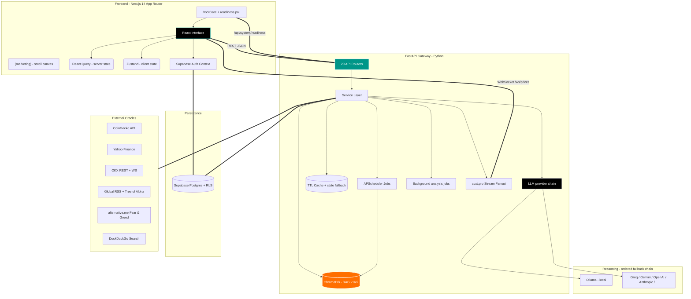

<div align="center">
  

  <h1 align="center">Oracle-X Financial Intelligence Terminal</h1>

  <p align="center">
    <strong>A unified terminal for equities and digital assets.</strong><br>
    <em>Market data, news reasoning and persistent memory in one surface, on an LLM layer you choose — local or cloud.</em>
  </p>

  <p align="center">
    <a href="#system-architecture"></a>
    <a href="#tech-stack"></a>
    <a href="#the-reasoning-layer"></a>
    <a href="#core-capabilities"></a>
    <br/>
    <a href="https://github.com/Yigtwxx/OracleX/releases/latest"></a>
    
    <a href="#quality-gates"></a>
    
    
    
  </p>
</div>

<details>
  <summary>Table of Contents</summary>
  <ol>
    <li><a href="#overview">Overview</a></li>
    <li><a href="#core-capabilities">Core Capabilities</a></li>
    <li><a href="#system-architecture">System Architecture</a></li>
    <li><a href="#directory-structure">Directory Structure</a></li>
    <li><a href="#tech-stack">Tech Stack</a></li>
    <li><a href="#installation">Installation</a></li>
    <li><a href="#running-with-docker">Running with Docker</a></li>
    <li><a href="#environment-configuration">Environment Configuration</a></li>
    <li><a href="#api-reference">API Reference</a></li>
    <li><a href="#quality-gates">Quality Gates</a></li>
    <li><a href="#roadmap">Roadmap</a></li>
    <li><a href="#contributing">Contributing</a></li>
    <li><a href="#security">Security</a></li>
  </ol>
</details>

---

## Overview

Traders, quantitative analysts and financial researchers work across several
tools at once: one for equities, another for crypto, a third for charts, and a
social feed for sentiment. Each switch costs time, and nothing carries context
across the boundary.

Oracle-X is an open-source intelligence terminal that puts those sources on one
screen. Real-time WebSockets, background scheduling, a persistent vector store
and a provider-agnostic reasoning layer let it do more than display the data —
it relates each piece to the history behind it.

The AI layer is local-first but not local-only. The default configuration
reasons entirely on your machine through [Ollama](https://ollama.com); a single
environment variable switches it to Groq, Gemini, Anthropic, OpenAI or any other
supported provider, behind an ordered fallback chain so one provider's outage or
rate limit is not the terminal's outage.

**Routes.** `/` is the public landing page. The terminal itself lives under
`/home`, `/overview`, `/dashboard`, `/analysis`, `/chat`, `/heatmap`, `/live`,
`/macro`, `/ownership`, `/social`, `/community`, `/profile` and `/admin`.

---

## Core Capabilities

### 1. Cross-Asset Market Matrix

Equities and digital assets are treated as one universe rather than two
integrations.

* **Equities (NASDAQ/NYSE):** live market caps, forward P/E ratios, analyst
  target bounds, margins and free cash flow, via Yahoo Finance `quoteSummary`
  HTTP modules.
* **Digital assets:** real-time price streaming and protocol metrics through
  CoinGecko V3 and the OKX public API.
* **Live asset registry:** which coins the overview shows, which stocks the
  NASDAQ page ranks and which pairs the socket streams are all resolved at
  runtime from CoinGecko / NASDAQ / OKX, never from a hardcoded list.
  Resolution degrades through an on-disk cache to a minimal emergency seed, so
  a cold start during an upstream outage still renders.
* **Asset detail modal:** 30+ data points per asset in one view — an equity's
  debt-to-equity ratio or a protocol's trailing four-week GitHub commit volume,
  without leaving the chart.

### 2. News Intelligence Pipeline

Keyword matching produces too many false positives for financial news, so
ingestion runs through the model instead.

* **Ingestion:** an `APScheduler` job polls global feeds every
  `NEWS_FETCH_INTERVAL_MINUTES` (default **2 min**) — Tree of Alpha, Decrypt,
  CoinDesk, CoinTelegraph, The Block, CryptoSlate, Koin Bülteni and Uzmancoin
  for crypto; MarketWatch, Investing.com and Seeking Alpha for equities.
* **Semantic ticker extraction:** article text is piped through the configured
  model, and `symbol_detection_service` fuses that with the live asset registry
  so headlines map to real tickers. `SYMBOL_DETECTION_CONCURRENCY` caps
  concurrency so a 150-item refresh never floods the provider.
* **Attribution memory:** a headline's asset is a property of its text, so it is
  resolved once and cached to disk (`news_attribution`). A restart does not
  re-bill the backlog, and a story can no longer be filed under BTC at 10:00 and
  ETH at 10:02. Results from the degraded heuristic path are marked and
  revisited.
* **Sentiment scoring:** bullish / bearish / neutral with a 0–100 confidence
  score. With no provider reachable, the pipeline degrades to heuristic
  extraction rather than failing.
* **Per-article research notes:** opening a headline starts a staged pipeline
  (`Gathering evidence → Judging price impact`) that fetches the full article
  body — with a hard timeout, a per-host circuit breaker and paywall-stub
  rejection — merges it with technical levels and market context, and returns a
  verdict. Technical levels are copied verbatim from
  `technical_analysis_service`; the model is never asked to invent a price.
  Finished analyses are persisted and keyed by pipeline version, so a prompt
  edit retires the cache instead of serving stale reasoning indefinitely.

### 3. RAG Memory Stack (v1 – v5)

A ChromaDB vector store with `qwen3-embedding:0.6b` embeddings turns every
ingested article and price tick into queryable memory. Retrieval is three-stage:
vector search fused with BM25 by reciprocal rank, a relevance floor calibrated
per collection, then a `bge-reranker-v2-m3` cross-encoder that reads the query
against each candidate. Measured on `backend/evals/golden_set.jsonl`, the
cross-encoder alone moves recall@5 from 0.79 to 0.96.

* **v1 — outcome memory** (`rag_service.py`): one collection linking historical
  news to the price outcome that followed. Feeds the `/api/analyze` flow.
* **v2 — temporal core** (`rag_v2_service.py`): the primary store, split into
  `historical_news`, `market_events` and `price_history` collections with up to
  365 days of indexed history and event correlation.
* **v3 — insights agent:** answers *"why did BTC move on this date?"* —
  price-movement reasoning, historical news similarity, event-at-date lookup.
* **v4 — reasoning agent:** two-asset comparison and what-if scenario
  simulation.
* **v5 — proactive agent:** generates the daily morning brief and flags
  price-vs-news anomalies without being asked.

Retrieval is scored rather than ranked by proximity alone. `rag_scoring.py`
composes recency (per-collection half-lives), move magnitude, event class and
symbol relevance behind a calibrated cosine floor (`RAG_MIN_RELEVANCE`, measured
with `scripts/calibrate_rag_relevance.py` rather than guessed). `rag_outcomes.py`
measures what an event actually did across **1/7/30/90/180/365-day horizons**
plus max drawdown and run-up, because a 7-day window labels both the XRP–SEC
suit and the NVDA–DeepSeek crash backwards. Precedents whose outcome
contradicted their headline are boosted, since those are the ones with something
to teach. `rag_bellwethers.py` bounds the cost by spending that measurement on
the assets that set market direction.

### 4. Oracle Chat Agent

A conversational analyst wired into the memory stack.

* Routes each question across RAG v2/v3/v4 plus live DuckDuckGo web search, then
  synthesizes with the configured model. Every leg is time-boxed independently,
  so a slow source degrades the answer instead of hanging it.
* Full session management — conversations, message history and renames persist
  in Supabase.
* Available as a dedicated page and as a global sidebar from anywhere in the
  terminal.

### 5. Staged Market Reports

`/api/analysis` produces daily / weekly / monthly reports through a four-stage
pipeline — `collecting → synthesis → drafting → review`.

* Stage 1 is pure Python: `analysis_data.py` assembles nine independent feeds
  into one deterministic snapshot and computes breadth, ratios and deltas
  itself, so arithmetic never reaches the model. A failing feed is recorded in
  `unavailable` rather than aborting the run.
* Stages 2–4 extract evidence, draft the report, then fact-check the draft back
  against the same snapshot, striking figures the data does not support.
* Generation is never triggered by a read. Callers `POST` a job and poll it; a
  second caller for the same timeframe joins the in-flight run instead of
  starting a duplicate.

### 6. Real-Time and Derivatives Data

* **Live price socket:** the frontend subscribes to Oracle-X's own `/ws/prices`
  endpoint, which fans out `ccxt.pro` exchange WebSocket streams to every
  connected client — one upstream connection, N browsers. The venue is
  configurable via `STREAM_EXCHANGE` (default **OKX**, because Binance is
  unreachable from several countries and fails on `load_markets()` before a
  single tick arrives).
* **Liquidation engine:** a long-running OKX liquidation WebSocket collector
  maintains rolling 24h history with disk persistence, powering the live feed
  and per-symbol levels.
* **Liquidation map:** a heatmap rebuilt from free OKX endpoints (candles, open
  interest, long/short account ratio). It models where leveraged positions would
  be force-closed — a different thing from the realised-liquidation feed above.
* **Funding rates and arbitrage:** perpetual funding rates on the home
  dashboard, plus a CCXT-backed multi-exchange price comparison and arbitrage
  scanner.

### 7. Alternative Data

* **Fear & Greed index** synchronized across the UI.
* **On-chain flows:** whale transfers and exchange inflow/outflow tracking
  (optional Etherscan key).
* **Institutional ownership:** 13F-style holdings tracking with per-entity
  boards and historical snapshots.
* **Developer velocity and social graph:** GitHub commit/issue velocity and
  community growth surfaced in the asset detail modal.

### 8. Accounts, Community and Bring-Your-Own-Key

* Supabase Auth (email/password and Google OAuth). **Authorization is enforced
  in the application layer** (`dependencies/auth.py`): the backend holds the
  service-role key and therefore bypasses RLS, so every user-scoped endpoint
  takes its identity from a verified bearer token, never from a client-supplied
  `user_id`.
* A community feed with posts, threaded comments, likes and moderation, plus an
  admin surface with audit logging.
* User profiles carrying subscription tier, connected accounts, preferences and
  an AI query quota.
* **Per-user LLM settings:** each user can pick their own provider and model and
  supply their own API key, scoped to chat, news and/or reports. Keys are
  encrypted with Fernet before they reach Supabase (`services/secret_box.py`)
  and are returned to the UI only as a hint, never in plaintext.

### 9. Boot Gate

A cold start touches a dozen upstreams. Rather than assembling itself panel by
panel over half a minute, the terminal holds its first paint on
`/api/system/readiness` and shows one splash with named steps (asset registry,
liquidation stream, news, model warm-up, RAG embeddings). Required steps block;
optional ones only mark the session degraded. The endpoint is pure in-memory
state — it is polled twice a second — and nothing in the startup path blocks the
socket from binding.

### 10. Landing Page

`/` is a scroll-driven marketing page rendered on a single `position: fixed` 2D
canvas. `lib/landing/stages.ts` is the one source of truth: each stage's height
in `svh` sizes both the DOM section and the canvas window it maps to, so the
copy and the chart it annotates cannot drift apart. The candle series is
generated from a seed rather than `Math.random`, so the page draws identically
on every mount. It shares fonts and design tokens with the terminal and nothing
else — no navigation chrome, no query client, no boot gate.

---

## System Architecture

Frontend and backend are strictly decoupled: the UI never blocks on a slow
upstream, and the API never renders.



---

## Directory Structure

### Backend (FastAPI)

```text
backend/
├── main.py                     # ASGI factory, lifespan warm-up, CORS, GZip, router injection
├── config.py                   # pydantic-settings Settings singleton (reads backend/.env)
├── pyproject.toml              # version, ruff (line-length 100) and pytest configuration
├── requirements.txt            # runtime dependencies
├── requirements-dev.txt        # test + lint deps only — CI installs these, not torch
├── .env.example                # environment template — copy to .env
├── dependencies/
│   └── auth.py                 # bearer-token verification; the authorization boundary
├── models/
│   └── schemas.py              # Pydantic request/response models
├── prompts/                    # prompt templates as plain Markdown, {{placeholder}} syntax
│   ├── analysis/               # stage1_evidence, stage2_report, stage3_review, system_analyst
│   └── news/ chat/ detection/ generic/
├── routers/                    # 20 modules — full paths inline, no prefixes
│   ├── news.py                 # /api/news, /api/analyze, /api/symbols, /api/technical
│   ├── llm.py                  # /api/llm/status
│   ├── system.py               # /api/system/readiness
│   ├── market.py               # /api/fear-greed, /api/market-overview, /api/heatmap/data
│   ├── liquidation.py          # /api/liquidations/*, /api/market/candles
│   ├── home.py                 # /api/home/* (funding, onchain, macro calendar)
│   ├── macro.py                # /api/macro/* (calendar, dashboard series)
│   ├── watchlist.py            # /api/home/watchlist CRUD
│   ├── analysis.py             # /api/analysis/reports, /api/analysis/jobs, notes
│   ├── rag.py                  # /api/rag/* (initialize, query, insights, scenario, brief)
│   ├── chat.py                 # /api/chat, sessions, message history
│   ├── auth.py                 # session verification helpers
│   ├── profile.py              # /api/profile/* (settings, subscription, quota, BYO-key)
│   ├── community.py            # /api/community/posts, comments, likes
│   ├── social.py               # /api/social/* (sentiment, follows, public profiles)
│   ├── ownership.py            # /api/ownership/* (institutional holdings, snapshots)
│   ├── live.py                 # /api/live/* (streams, events)
│   ├── admin.py                # /api/admin/* (moderation, audit log)
│   ├── exchanges.py            # /api/exchanges, /api/multi-exchange, /api/arbitrage
│   └── websocket.py            # /ws/prices, /api/websocket/status
├── services/                   # business logic — 68 modules plus admin/, community/,
│   │                           # llm/, ownership/ and social/ packages
│   ├── llm/                    # provider abstraction
│   │   ├── presets.py          # 14 provider rows (adapter, base_url, default model, key env)
│   │   ├── providers.py        # openai_compat / anthropic / ollama adapters
│   │   ├── client.py           # chain resolution, retries, rate-limit + daily-quota cooldowns
│   │   └── user_prefs.py       # per-user provider override resolution
│   ├── secret_box.py           # Fernet encryption for per-user API keys
│   ├── llm_settings_service.py # per-user provider/model/key persistence
│   ├── ai_service.py           # prompt assembly, response parsing, fallbacks
│   ├── prompts.py              # file-backed prompt loader ({{name}} substitution)
│   ├── prompt_budget.py        # token-ceiling context fitting
│   ├── readiness.py            # startup step tracking for the boot gate
│   ├── asset_registry.py       # live coin/stock/pair universe + disk cache + seed
│   ├── analysis_data.py        # deterministic market snapshot (no LLM)
│   ├── analysis_service.py     # four-stage market report pipeline
│   ├── analysis_jobs.py        # in-process job runner with stage progress + partials
│   ├── news_service.py         # RSS + Tree of Alpha aggregation
│   ├── article_service.py      # full-article extraction (timeout, breaker, paywall reject)
│   ├── news_analysis_service.py / news_analysis_store.py   # per-article research notes
│   ├── news_attribution.py     # persistent headline → asset memory
│   ├── symbol_detection_service.py  # LLM + registry ticker resolution
│   ├── rag_service.py          # RAG v1 — outcome memory
│   ├── rag_v2_service.py       # RAG v2 — temporal core (3 collections)
│   ├── rag_v3_service.py / rag_v4_service.py / rag_v5_service.py   # agent layer
│   ├── rag_scoring.py          # pure composite relevance/importance scoring
│   ├── rag_outcomes.py         # multi-horizon outcome measurement
│   ├── rag_bellwethers.py      # curated direction-setting asset universe
│   ├── chat_service.py         # Oracle chat orchestration (RAG + web search + LLM)
│   ├── okx_market.py           # single client for prices, candles, trades
│   ├── price_service.py        # server-side single-symbol price resolution
│   ├── liquidation_service.py  # OKX liquidation WS collector (persisted)
│   ├── liquidation_map_service.py  # modelled liquidation heatmap from free OKX data
│   ├── websocket_service.py    # ccxt.pro price stream fanout
│   ├── ccxt_service.py         # multi-exchange REST + arbitrage
│   ├── asset_detail_service.py # 30+ field aggregator for the detail modal
│   ├── market_overview_service.py / stock_market_service.py / heatmap_service.py
│   ├── fear_greed_service.py / onchain_service.py / technical_analysis_service.py
│   ├── web_search_service.py   # DuckDuckGo search for the chat agent
│   ├── supabase_service.py / profile_service.py / watchlist_service.py
│   ├── scheduler_service.py    # APScheduler: news fetch + RAG re-index jobs
│   ├── http_client.py          # shared async httpx client (+ impersonated transport)
│   └── cache.py                # ServiceCache (TTLCache) with stale-data fallback
├── evals/golden_set.jsonl      # retrieval evaluation set
├── tests/                      # 63 pytest modules — run in CI
└── data/                       # local JSON state + ChromaDB stores (gitignored)
```

### Frontend (Next.js 14 App Router)

```text
frontend/
├── next.config.js              # strict mode + /api/* rewrite proxy to the backend
├── tailwind.config.ts          # UI token system, custom hex colors
├── tsconfig.json               # strict TypeScript compilation
├── vitest.config.ts            # unit test runner
├── .eslintrc.json / .prettierrc
├── .env.example                # copy to .env.local
├── app/
│   ├── layout.tsx              # fonts, tokens, AuthProvider, HydrationBeacon
│   ├── globals.css             # token definitions + terminal and landing styles
│   ├── (marketing)/            # the public landing page at /
│   │   ├── layout.tsx          # sets .landing, scopes the marketing CSS
│   │   └── page.tsx
│   └── (app)/                  # the terminal — route group, absent from the URL
│       ├── layout.tsx          # ClientShell composition
│       ├── home/               # home dashboard (/home)
│       ├── overview/           # cross-asset market matrix
│       ├── dashboard/          # news + charts + Oracle panel
│       ├── analysis/           # AI timeframe reports and notes
│       ├── chat/               # Oracle chat agent
│       ├── heatmap/            # multi-metric heatmap
│       ├── live/               # live streams and events
│       ├── macro/              # macro calendar and dashboard
│       ├── ownership/          # institutional holdings
│       ├── social/             # sentiment and public profiles
│       ├── community/          # social feed and post detail
│       ├── profile/            # account, subscription, AI provider settings
│       ├── admin/              # moderation and audit
│       ├── u/[userId]/         # public user profile
│       └── auth/ error.tsx
├── components/
│   ├── ClientShell.tsx         # QueryClientProvider + Navigation + GlobalTicker + Toasts
│   ├── HydrationBeacon.tsx     # proof of life for the chunk-recovery watchdog
│   ├── BootGate.tsx / BootSplash.tsx   # holds first paint until the backend is ready
│   ├── ErrorBoundary.tsx
│   ├── landing/                # ScrollCanvas, TypedPoints, StageFigure, hero and sections
│   ├── ui/                     # Panel, Modal, Logo, AssetTag, ShinyText primitives
│   ├── analysis/               # ReportView, AnalysisProgress, StageChecklist, NotesPanel
│   ├── overview/               # AdvancedHeatmap, AssetDetailModal, AssetTable, ...
│   ├── home/                   # FundingRates, LiquidationFeed, OnChainStats, Watchlist, ...
│   ├── macro/ live/ ownership/ social/ admin/ chat/ charts/
│   ├── profile/AIProviderSettings.tsx   # BYO provider/model/API key UI
│   ├── community/              # PostCard, PostMedia, CreatePostModal
│   └── NewsFeed.tsx / ChartPanel.tsx / OraclePanel.tsx / ChatSidebar.tsx / ...
├── contexts/AuthContext.tsx    # Supabase session, signIn/signUp/signOut/OAuth
├── hooks/
│   ├── queries.ts              # React Query keys + typed hooks (optimistic mutations)
│   ├── useReadiness.ts         # /api/system/readiness poller for the boot gate
│   ├── useWebSocketPrices.ts   # /ws/prices client, reconnect + flash animation
│   └── usePriceAlerts.ts       # global price alert watcher
├── lib/
│   ├── api.ts                  # fetch wrapper, ApiError, typed endpoint fetchers
│   ├── queryClient.ts          # QueryClient + global error → toast wiring
│   ├── supabase.ts             # lazy browser Supabase client
│   └── landing/                # scroll canvas engine — stages, series, renderer (tested)
├── public/landing/             # stage imagery + CREDITS.md
└── store/useStore.ts           # Zustand global client state
```

### Repository Root

```text
.
├── start.sh / start.bat        # launchers (venv, ports, both servers, RAG seed)
├── docker-compose.yml          # production-shaped stack
├── docker-compose.override.yml # dev overrides (bind mounts, --reload, next dev)
├── supabase/migrations/        # 001_initial_schema → 013_social
├── scripts/
│   ├── calibrate_rag_relevance.py   # measures the RAG relevance floor against your store
│   ├── fetch_landing_imagery.sh     # rebuilds the landing imagery set from Wikimedia
│   └── generate_brand_assets.py
├── .github/workflows/ci.yml    # ruff + compileall + pytest | lint, typecheck, test, build
└── .pre-commit-config.yaml     # ruff (backend) + prettier (frontend) + hygiene hooks
```

---

## Tech Stack

### UI Layer (Next.js 14 App Router)

* **Framework:** SWC-compiled builds; server components keep client bundles
  lean.
* **Server state (React Query):** every backend read goes through
  `@tanstack/react-query` with a central key registry (`hooks/queries.ts`), 30s
  stale time, exponential-backoff retries and a global error handler that
  surfaces failures as toasts (`lib/queryClient.ts`). Mutations such as
  watchlist deletion are optimistic with automatic rollback.
* **Client state (Zustand):** the Context API re-renders the whole subtree.
  Zustand binds real-time WebSocket price updates to individual components
  without re-rendering the heatmap.
* **Styling (Tailwind CSS):** no component library — a token system and a small
  set of shared primitives in `components/ui`, for exact control over a dense
  dark interface.
* **Charting:** Apache ECharts for the data-dense panels (liquidation heatmap,
  treemaps) and embedded TradingView widgets for classic price action.

### API Engine (FastAPI, Python 3.11+)

* **Asynchronous IO:** the backend is `async def` throughout. Outbound calls
  share one configured `httpx.AsyncClient` (`services/http_client.py`); blocking
  work is dispatched to thread pools so the event loop never stalls.
* **Non-blocking startup:** uvicorn binds its socket before any warm-up runs.
  Registry priming, model loading, the first news fetch and embedding warm-up
  execute as tracked background tasks that report into `readiness`, so the boot
  gate can poll from the first second.
* **Configuration (pydantic-settings):** a cached `Settings` singleton reads
  `backend/.env`, exposing typed feature flags, intervals, provider chains and
  CORS origins, and failing fast at startup when Supabase credentials are
  absent.
* **Caching:** a `cachetools`-backed `ServiceCache` with per-service TTLs and
  stale-data fallback — if an upstream rate-limits, the last good payload is
  served instead of an error.
* **Transport realism:** a `curl_cffi` transport replays a browser TLS/HTTP2
  fingerprint for the few upstreams that fingerprint the handshake (CNN's Fear &
  Greed feed, Yahoo's chart API) and answer 418 to ordinary clients regardless
  of User-Agent.
* **Scheduling and jobs:** `APScheduler` drives periodic news ingestion and RAG
  re-indexing; `analysis_jobs` runs the long LLM pipelines out of the request
  path with pollable stage progress.

### The Reasoning Layer

* **14 providers, one interface.** `ollama`, `groq`, `gemini`, `openai`,
  `anthropic`, `openrouter`, `deepseek`, `together`, `mistral`, `xai`,
  `cerebras`, `fireworks`, `perplexity` and `custom` (any self-hosted vLLM /
  LM Studio / LiteLLM proxy). Adding one is a row in `presets.py`, not new code,
  as long as it speaks the OpenAI chat-completions format — which nearly all of
  them do. Two adapters cover the rest: Ollama's native API, and Anthropic's
  `/v1/messages` (its OpenAI shim is documented as beta and not intended for
  production).
* **Ordered fallback chain.** `LLM_PROVIDER` names the primary and
  `LLM_FALLBACK_PROVIDERS` the chain behind it. An entry is skipped when it is
  unreachable, its key is missing, its model id is unknown, or it is still
  rate-limited after its retries.
* **Rate limits are first-class.** A 429 with a stated delay is waited out only
  if it fits `LLM_RATE_LIMIT_MAX_WAIT`; otherwise the chain moves on and that
  provider goes on cooldown, because free tiers count rejected calls against the
  same quota. A spent daily budget gets a much longer cooldown
  (`LLM_DAILY_QUOTA_COOLDOWN`), since providers report it as if it were a
  rolling minute.
* **Local-first defaults.** With `LLM_PROVIDER=ollama`, headlines, portfolios
  and chat questions never leave the machine. `qwen3.6:35b-a3b` (MoE, ~3B active
  params) is the recommended default; `qwen3.5:9b` fits lighter hardware.
  `OLLAMA_KEEP_ALIVE` keeps the model resident so a quiet period is not followed
  by a reload that times out every racing call.
* **Prompts live in files.** `backend/prompts/**.md` with `{{placeholder}}`
  substitution — reviewable and tunable without touching Python.
* **Graceful degradation.** Every LLM call has a fallback path, so the terminal
  stays usable with no provider at all: you lose AI scoring and chat, not market
  data.
* **Embeddings** run through the local Ollama daemon (`qwen3-embedding:0.6b`,
  1024-dim, multilingual), warmed at startup. The cross-encoder reranker loads
  on CUDA / MPS / CPU depending on the host.
* **The prompt is budgeted, not truncated.** Ollama cuts an over-long prompt
  from the front, and the system prompt renders first — so an overflow silently
  deletes the rules that forbid invented figures. `services/prompt_budget.py`
  fits the context to a token ceiling first, sacrificing the oldest conversation
  turns instead, and the hard constraints ride at the tail of the turn prompt
  where truncation cannot reach them.

---

## Installation

Oracle-X runs locally on macOS, Windows or a Linux server.

### Prerequisites

| Requirement | Minimum version | Notes |
|-------------|-----------------|-------|
| Node.js | v18.17.0 | Required for Next.js 14 (CI builds on v20) |
| Python | v3.11 | Matches CI |
| npm | Latest | Package management |
| Git | Latest | For cloning the repository |
| Ollama | Latest | **Optional** — only for `LLM_PROVIDER=ollama`; a cloud key works instead |

> **Hardware note:** `qwen3.6:35b-a3b` needs roughly 24 GB of free RAM/VRAM;
> `qwen3.5:9b` fits in about 7 GB. On Apple Silicon both run on the Metal
> backend out of the box. If you would rather not run a local model, set
> `LLM_PROVIDER=groq:llama-3.3-70b-versatile` (or any other supported provider)
> and skip Ollama entirely.

### Scripted setup (recommended)

`start.sh` (macOS/Linux) and `start.bat` (Windows) provision the virtualenv,
free ports 8000/3100, boot both servers, and seed the RAG index by POSTing
`/api/rag/initialize` once the API is healthy.

```bash
# 1. Clone
git clone https://github.com/Yigtwxx/OracleX.git
cd OracleX

# 2. Configure
cp backend/.env.example backend/.env
cp frontend/.env.example frontend/.env.local
# → fill in your Supabase credentials (required)
# → pick an LLM provider: keep the Ollama default, or set LLM_PROVIDER + its API key

# 3. Only if running the model locally: pull it once
ollama pull qwen3.6:35b-a3b

# 4. Start
chmod +x start.sh
./start.sh
```

On Windows, skip the `cp` and `chmod` steps — `start.bat` copies the `.env`
templates itself:

```bat
git clone https://github.com/Yigtwxx/OracleX.git
cd OracleX
ollama pull qwen3.6:35b-a3b
start.bat
```

> Windows builds its own virtualenv at `backend\venv-win\` so it never collides
> with the POSIX `backend/venv/` that `start.sh` creates. Backend and frontend
> each open in their own console window; close them to stop the services.

### Manual setup

**1. Backend**

```bash
cd backend

# start.sh expects this exact path
python3 -m venv venv
source venv/bin/activate        # Windows: venv\Scripts\activate

pip install -r requirements.txt
cp .env.example .env

uvicorn main:app --reload --host 0.0.0.0 --port 8000
```

Health check at `http://localhost:8000/`, Swagger UI at
`http://localhost:8000/docs`, startup progress at `/api/system/readiness`.

**2. Frontend**

```bash
cd frontend

npm install
cp .env.example .env.local

npm run dev
```

The landing page is at `http://localhost:3100`; the terminal is at
`http://localhost:3100/home`.

**3. Seed the vector memory (optional, one time)**

```bash
curl -X POST http://localhost:8000/api/rag/initialize
```

---

## Running with Docker

The whole stack is containerized. One `.env` at the repository root configures
both services.

**Prerequisites:** Docker Desktop (`brew install --cask docker-desktop` on
macOS, then open `/Applications/Docker.app` once to grant permissions).

```bash
cp .env.example .env      # then fill in the Supabase values
docker compose up --build
```

Frontend at `http://localhost:3100`, backend at `http://localhost:8000`.

### Development vs production

`docker-compose.override.yml` is loaded automatically and turns the stack into a
development environment: source is bind-mounted, uvicorn runs with `--reload`,
and the frontend runs `next dev`.

To run the production images instead — multi-stage builds, `next start` on a
standalone bundle — skip the override explicitly:

```bash
docker compose -f docker-compose.yml up --build
```

### Ollama

If you use the local provider, Ollama runs on the host, not in a container: on
Apple Silicon a containerized Ollama cannot reach the Metal GPU, which makes the
default model unusably slow. The backend is preconfigured for
`http://host.docker.internal:11434`, so once you `ollama pull <model>` on the
host it connects. Until then the backend starts normally and only logs a
warning — AI features fall through the chain or switch off. With a cloud
provider configured, none of this applies.

### Deploying to a server

Three values change together, since the browser (not the container) resolves
them:

| Variable | Local | Server |
|---|---|---|
| `NEXT_PUBLIC_API_URL` | `http://localhost:8000` | `https://api.yourdomain.com` |
| `NEXT_PUBLIC_WS_URL` | `ws://localhost:8000/ws/prices` | `wss://api.yourdomain.com/ws/prices` |
| `CORS_ORIGINS` | `http://localhost:3100` | `https://yourdomain.com` |

`NEXT_PUBLIC_*` values are baked into the client bundle at build time, so
changing them requires a rebuild (`docker compose build frontend`), not just a
restart.

Runtime state — Chroma vector stores, watchlists, analysis reports, liquidation
history — lives in the `backend-data` named volume and survives
`docker compose down`. Use `docker compose down -v` only when you intend to wipe
it.

The backend runs a **single uvicorn worker** by design: the APScheduler jobs,
the liquidation collector, the analysis job registry and the price-streaming
service are per-process singletons, so scaling means running one container, not
more workers.

---

## Environment Configuration

Both sides ship a committed `.env.example` — copy it rather than guessing.
Every variable has a working default except the Supabase credentials, which the
backend validates at startup and refuses to boot without. Features whose key is
missing simply switch off.

### `backend/.env`

```env
# ── Supabase (required — startup fails without these) ────────────────────────
SUPABASE_URL=https://your-project.supabase.co
SUPABASE_KEY=your-publishable-anon-key
# Service-role key bypasses RLS — keep it secret, backend only.
SUPABASE_SERVICE_ROLE_KEY=your-service-role-secret-key

# ── LLM provider ─────────────────────────────────────────────────────────────
# Format: <provider> or <provider>:<model>. Only the FIRST colon splits them,
# so Ollama tags survive: ollama:qwen3.6:35b-a3b
# Supported: ollama, groq, gemini, openai, anthropic, openrouter, deepseek,
#            together, mistral, xai, cerebras, fireworks, perplexity, custom
LLM_PROVIDER=ollama
LLM_FALLBACK_PROVIDERS=            # e.g. gemini:gemini-flash-latest,ollama
LLM_MODEL=qwen3.6:35b-a3b          # used when a chain entry omits ":<model>"
LLM_MAX_RETRIES=3
LLM_RATE_LIMIT_MAX_WAIT=30         # 60 rides out a free-tier per-minute quota
LLM_RATE_LIMIT_COOLDOWN=60
LLM_DAILY_QUOTA_COOLDOWN=1800

# Encrypts per-user API keys before they reach Supabase. Empty disables the
# BYO-key feature entirely — a key is never stored in plaintext.
#   python -c "from cryptography.fernet import Fernet; print(Fernet.generate_key().decode())"
LLM_KEY_ENCRYPTION_SECRET=

# Only for LLM_PROVIDER=custom (self-hosted vLLM / LM Studio / LiteLLM proxy).
LLM_BASE_URL=
LLM_API_KEY=

# ── Local LLM (Ollama) ───────────────────────────────────────────────────────
OLLAMA_BASE_URL=http://localhost:11434
OLLAMA_KEEP_ALIVE=30m              # "-1" pins the model until the daemon stops

# ── Provider API keys — fill in only the one(s) you use ──────────────────────
GROQ_API_KEY=
GEMINI_API_KEY=
OPENAI_API_KEY=
ANTHROPIC_API_KEY=
OPENROUTER_API_KEY=
DEEPSEEK_API_KEY=
TOGETHER_API_KEY=
MISTRAL_API_KEY=
XAI_API_KEY=
CEREBRAS_API_KEY=
FIREWORKS_API_KEY=
PERPLEXITY_API_KEY=

# ── Optional external API keys ───────────────────────────────────────────────
ETHERSCAN_API_KEY=          # on-chain exchange flows; empty disables the feature

# ── Market data ──────────────────────────────────────────────────────────────
# CCXT exchange id for the live price socket. Binance is blocked in several
# countries and fails on load_markets(); any CCXT Pro venue with watch_tickers
# works — okx, bybit, kucoin, coinbase, kraken…
STREAM_EXCHANGE=okx

# ── Feature flags ────────────────────────────────────────────────────────────
USE_REAL_API=true
USE_AI=true                 # master switch for AI, whichever provider is set

# ── CORS (comma-separated allowed frontend origins) ──────────────────────────
CORS_ORIGINS=http://localhost:3100,http://127.0.0.1:3100

# ── Background scheduler intervals (minutes) ─────────────────────────────────
NEWS_FETCH_INTERVAL_MINUTES=2
RAG_INDEX_INTERVAL_MINUTES=30

# ── Logging (DEBUG | INFO | WARNING | ERROR) ─────────────────────────────────
LOG_LEVEL=INFO
```

RAG retrieval tuning (`RAG_MIN_RELEVANCE`, recency half-lives, importance
weights, outcome horizons) all have measured defaults in `config.py` and are
documented, commented out, in `backend/.env.example`. Re-measure the relevance
floor against your own store rather than guessing at it:

```bash
cd backend && ./venv/bin/python ../scripts/calibrate_rag_relevance.py
```

### `frontend/.env.local`

```env
NEXT_PUBLIC_API_URL=http://localhost:8000
NEXT_PUBLIC_WS_URL=ws://localhost:8000/ws/prices

# Client-side auth — publishable/anon key only, never the service-role key.
NEXT_PUBLIC_SUPABASE_URL=https://your-project.supabase.co
NEXT_PUBLIC_SUPABASE_ANON_KEY=your-publishable-anon-key
```

### Supabase schema

Apply the migrations in `supabase/migrations/` in order, from
`001_initial_schema.sql` through `013_social.sql`, via the Supabase SQL editor
or CLI. Without them, auth-gated pages (chat history, community, profile,
ownership, per-user AI settings) will render but fail to persist.

### Degradation matrix

| Missing | Consequence |
|---------|-------------|
| No reachable LLM provider | No AI sentiment, research notes, market reports or Oracle chat. Market data, charts and heatmaps unaffected. |
| Supabase credentials | **Backend refuses to start** — these are validated at boot. |
| `LLM_KEY_ENCRYPTION_SECRET` | Per-user BYO-key feature is disabled; the server-side provider chain still works. |
| `ETHERSCAN_API_KEY` | On-chain whale and exchange-flow widgets go empty. |
| Upstream market API down | Last good cached payload is served (stale fallback) instead of an error. |

---

## API Reference

Oracle-X is a headless data provider as well as a terminal: bots and scripts can
use the FastAPI endpoints directly without opening the UI. All payloads return
`application/json`; user-scoped routes require a Supabase bearer token.

### Market data

| Endpoint | Method | Response payload and logic |
|----------|--------|-----------------|
| `/api/market-overview` | `GET` | Global crypto market cap, dominance and top movers from CoinGecko's `/global` and `/coins/markets`. |
| `/api/nasdaq-overview` | `GET` | Live cached metrics for the "Magnificent 7" and core equities. |
| `/api/market/indices` | `GET` | Traditional index snapshots. |
| `/api/asset-detail/{symbol}` | `GET` | Resolver combining CoinGecko ID mapping and Yahoo Finance `quoteSummary`. Returns 30+ fields. |
| `/api/price/{symbol}` | `GET` | Single spot price, crypto or equity, resolved server-side. |
| `/api/market/candles/{symbol}` | `GET` | OHLCV series from OKX. |
| `/api/heatmap/data` | `GET` | Nested JSON structured for treemap consumption — price change, volume, social hype, dev activity. |
| `/api/fear-greed` | `GET` | Integer index (`0-100`) plus sentiment categorization. |
| `/api/technical/{symbol}` | `GET` | ATR-based support/resistance and price targets from OKX OHLCV. |

### News and AI

| Endpoint | Method | Response payload and logic |
|----------|--------|-----------------|
| `/api/news` | `GET` | Articles scored bullish/bearish/neutral with confidence and LLM-extracted tickers. |
| `/api/news/{news_id}` | `GET` | A single article by id. |
| `/api/news/{news_id}/analysis/jobs` | `POST` | Starts the staged per-article research note; joins an in-flight run for the same article. |
| `/api/news/analysis/jobs/{job_id}` | `GET` | Polls that job for its stage, partial result and final verdict. |
| `/api/news/{news_id}/analysis` | `GET` | The cached analysis, if one exists for the current pipeline version. |
| `/api/analyze` | `POST` | Runs a single article through the LLM and RAG v1 outcome memory. |
| `/api/symbols` | `GET` | Currently tracked symbol universe. |
| `/api/llm/status` | `GET` | Active provider/model, the resolved fallback chain, skipped entries and why. `?include_models=true` lists what each provider currently offers. Keys are never returned. |
| `/api/analysis/reports` | `GET` | Freshness of the stored daily/weekly/monthly reports. Never generates. |
| `/api/analysis/report/{timeframe}` | `GET` | The stored market report, or an empty one if it has not been generated yet. |
| `/api/analysis/jobs/{timeframe}` | `POST` | Starts the four-stage report pipeline in the background; joins an in-flight run for the same timeframe. |
| `/api/analysis/jobs/{job_id}` | `GET` | Polls a running report job for its stage, and its result once finished. |

### RAG and agents

| Endpoint | Method | Response payload and logic |
|----------|--------|-----------------|
| `/api/rag/initialize` | `POST` | Seeds the v2 store with historical news, events and prices. |
| `/api/rag/stats` | `GET` | Collection counts and index health. |
| `/api/rag/query` | `GET` | Semantic search across the temporal memory, composite-scored. |
| `/api/rag/news-similarity` | `POST` | Nearest historical precedents for a supplied headline. |
| `/api/rag/event-at-date` | `GET` | What the store knows happened on a given date. |
| `/api/rag/insights/{symbol}` | `GET` | v3 insights agent — why an asset moved. |
| `/api/rag/compare/{a}/{b}` | `GET` | v4 reasoning agent — two-asset comparison. |
| `/api/rag/scenario` | `POST` | v4 what-if scenario simulation. |
| `/api/rag/daily-brief` | `GET` | v5 proactive agent — morning brief. |
| `/api/rag/anomalies` | `GET` | v5 price-vs-news divergence detection. |
| `/api/chat` | `POST` | Oracle chat agent (RAG + web search + configured LLM). |
| `/api/chat/status` | `GET` | Whether the chat agent is available, and which provider is serving it. |

### Derivatives, exchanges and real-time

| Endpoint | Method | Response payload and logic |
|----------|--------|-----------------|
| `/api/liquidations/heatmap` | `GET` | Aggregated realised-liquidation clusters from the OKX WS collector. |
| `/api/liquidations/map/{symbol}` | `GET` | Modelled liquidation map — where leveraged positions would be force-closed. |
| `/api/liquidations/levels/{symbol}` | `GET` | Per-symbol liquidation levels. |
| `/api/liquidations/history/{symbol}` | `GET` | Rolling 24h realised-liquidation history. |
| `/api/home/funding-rates` | `GET` | Perpetual funding rates across major pairs. |
| `/api/home/onchain` | `GET` | Whale transfers and exchange in/outflows. |
| `/api/macro/*` | `GET` | Macro calendar entries and dashboard series. |
| `/api/exchanges` | `GET` | CCXT-supported exchange registry. |
| `/api/arbitrage/{base}/{quote}` | `GET` | Cross-exchange spread for a pair; `/api/arbitrage/scan` sweeps the board. |
| `/ws/prices` | `WS` | Live price stream — `snapshot` on connect, then `price_update` frames. |

### User, social and system

| Endpoint | Method | Response payload and logic |
|----------|--------|-----------------|
| `/api/system/readiness` | `GET` | Startup progress for the boot gate — per-step state, `ready`, `degraded`, `blocked`. No I/O. |
| `/api/home/watchlist` | `GET/POST/DELETE` | Watchlist CRUD with live prices merged in. |
| `/api/analysis/notes` | `GET/POST/DELETE` | Personal research notes. |
| `/api/profile` | `GET/PUT` | Profile, subscription, connected accounts, settings. Identity comes from the token. |
| `/api/profile/llm` | `GET/PUT/DELETE` | Per-user provider, model and encrypted API key. `POST /api/profile/llm/test` validates a key before saving. |
| `/api/community/posts` | `GET/POST` | Community feed; nested comment and like routes below it. |
| `/api/social/*` | `GET/POST` | Sentiment, follows and public profiles. |
| `/api/ownership/*` | `GET` | Institutional holdings boards and historical snapshots. |
| `/api/admin/*` | `GET/POST` | Moderation actions and the audit log. Admin-scoped. |

### Example request

```python
import httpx

# Fetch detailed NVIDIA fundamentals from a local instance
r = httpx.get("http://localhost:8000/api/asset-detail/NVDA")
data = r.json()

print(f"Forward P/E: {data['forward_pe']}")
print(f"Target High: {data['target_high_price']}")
print(f"Analyst Rec: {data['recommendation']}")
```

---

## Quality Gates

CI (`.github/workflows/ci.yml`) runs on every push and pull request to `main`,
in two jobs:

| Job | Steps |
|-----|-------|
| **Backend** (Python 3.11) | `ruff check .` → `python -m compileall` → `pytest` |
| **Frontend** (Node 20) | `npm ci` → `npm run lint` → `npm run typecheck` → `npm test` → `npm run build` |

The backend suite is **63 pytest modules** covering the LLM chain and
rate-limit behaviour, per-user settings and key encryption, auth enforcement,
prompt rendering, RAG scoring and outcomes, symbol detection, news attribution
and the analysis pipelines. `requirements-dev.txt` deliberately excludes torch
and chromadb so CI installs only what the tests import.

The frontend suite is **15 vitest modules, 222 tests**, concentrated on the
pure logic where a failure would be silent rather than loud — the scroll canvas
stage schedule, the seeded candle series and the note anchors.

`.pre-commit-config.yaml` wires the same tools locally:

```bash
pip install pre-commit && pre-commit install
pre-commit run --all-files
```

---

## Roadmap

Shipped in **v1.0.0**:

- [x] Dark-mode terminal layout, component system, App Router routing.
- [x] Real-time market data (CoinGecko, Yahoo Finance `quoteSummary`, OKX) with
      a TTL caching layer and stale fallback.
- [x] Semantic news pipeline, asset detail views and heatmap algorithms.
- [x] Supabase Auth with application-layer authorization — profiles, community
      feed, chat history.
- [x] ChromaDB RAG v2 temporal store, the v3/v4/v5 agent layer, and the Oracle
      chat agent with web-search augmentation.
- [x] Provider-agnostic LLM layer with fallback chains and rate-limit handling,
      per-user BYO keys encrypted at rest, file-backed prompts, staged
      report/news pipelines with job polling, calibrated RAG scoring with
      multi-horizon outcomes, and the startup boot gate.
- [x] Institutional ownership tracking, macro dashboard, live events, social
      sentiment and admin moderation with audit logging.

Shipped in **v1.1.0**:

- [x] Public landing page on a scroll-driven canvas; the terminal moves into an
      `(app)` route group.

Planned:

- [ ] **v1.2 (Hardening):** contract tests over the endpoint matrix, broader
      component coverage.
- [ ] **v1.3 (Personalization):** migration of watchlists and notes off JSON
      onto Supabase, portfolio allocation views, saved dashboard layouts.
- [ ] **v2.0 (On-chain track record):** Solidity oracles committing AI price
      impact probabilities to the Sepolia testnet for immutable track-record
      tracking.

---

## Contributing

Contributions are welcome, on the backend, the frontend or the data layer.
[CONTRIBUTING.md](CONTRIBUTING.md) covers the development setup, the coding
standards and what a reviewable pull request looks like. The short version:

1. **Fork** the repository and **branch** off `main` — `git checkout -b feat/your-feature`.
2. **Commit** using conventional commits — `git commit -m 'feat(api): add funding rate history endpoint'`.
3. **Run the gates** below.
4. **Open a pull request** targeting `main`, with screenshots for UI changes.

```bash
# Backend — the first three are CI; ruff format is enforced by pre-commit.
cd backend && ruff check . && python -m compileall -q -x "venv|data" . && pytest && ruff format --check .

# Frontend — stop the dev server first; it shares .next with the build.
cd frontend && npm run lint && npm run typecheck && npm test && npm run build
```

Endpoints without test coverage should still be exercised manually against
`http://localhost:8000/docs`; note what you verified in the pull request
description.

Participation is governed by the [Code of Conduct](CODE_OF_CONDUCT.md).

---

## Security

Do not open a public issue for a vulnerability. The
[security policy](SECURITY.md) sets out what is in scope, how to report
privately, and the two deployment settings — the service-role key and
`CORS_ORIGINS` — that account for most of the real risk.

---

## License

MIT. See [LICENSE](LICENSE).
